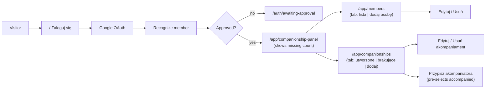
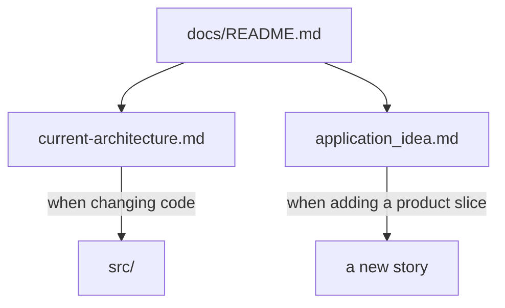

# emmaCompanionship documentation

Start here. These files describe the **current** application plus the **domain destination**. Planning history lives in git, not in this folder.

## What the app is today

A closed, members-only web app. Google confirms identity. The application recognizes that person as a member (existing or pending). Only an **approved** member (`is_active` and not revoked) may stay under `/app`. From the panel they can open **Członkowie wspólnoty** or **Akompaniamenty**. The panel card shows how many people still await a companion.



## What it is not yet

Business-rule validation (gender, consecrated constraints, power separation), couple or geography assignment, supervision relations, graphs, Excel/CSV import, health views, role assignment UI, admin approval UI, password login, Facebook (or any second OAuth provider).

## Read order

1. **This file** — orientation.
2. **[current-architecture.md](./current-architecture.md)** — stack, hexagon, auth, UI, database honesty, how to run and extend.
3. **[application_idea.md](./application_idea.md)** — domain language and future product. Read it as destination, not as “implement now”.
4. **[organic-growth.md](./organic-growth.md)** — why we do not rebuild unused architecture; read before proposing new layers or plans.



## How to run (short)

```bash
cp .env.example .env.local          # AUTH_SECRET + Google credentials
# create .env.development with DB_* (see .env.example) — needs Python 3.10+ for db:* scripts
npm run db:start
npm run db:migrate:dev
npm run dev
```

Host Postgres port and `DB_PORT` must match. Compose defaults the published port to **5433**; the Node pool defaults to **5432** if `DB_PORT` is unset. Details in [current-architecture.md](./current-architecture.md#local-development). DB operator scripts overview: [db/README.md](../db/README.md).

## Do not load as current truth

- `_archived_docs/` — old PRD, architecture, research.
- Old implementation plans (auth-closed-system, Prisma checklists) — git history only. The lesson from that era is [organic-growth.md](./organic-growth.md), not those plans.
