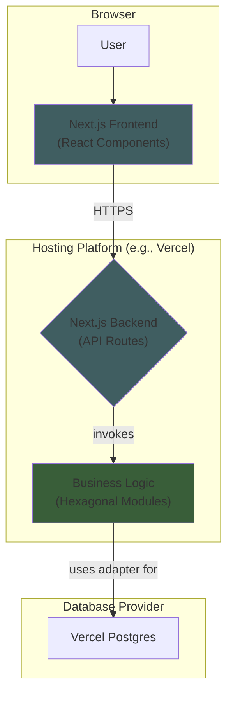

Excellent. Let's proceed with creating the architecture.

We have already established the foundational principles in our Architectural Decision Records (ADRs). The next step is to formalize these into the **High-Level Architecture** section of our document. This section will provide a comprehensive overview of the system's structure and the core patterns that will guide its development.

Here is the drafted section for your review.

-----

## High-Level Architecture

### Technical Summary

The architecture for `emmaCompanionship` is a unified full-stack application built entirely in **TypeScript**. It leverages the **Next.js framework** for both the frontend (React) and the backend API (API Routes), all managed within a single **Monorepo**. The backend is designed as a **Modular Monolith**, with each internal module adhering to the **Hexagonal Architecture** pattern to ensure maintainability and future portability. For the POC, the application and its **PostgreSQL** database will be hosted on **Vercel**.

### Platform and Infrastructure Choice

  * **Platform**: The application is a self-contained, full-stack Next.js application. For the initial POC, it will be hosted on **Vercel's Hobby tier**.
  * **Database**: We will use **Vercel Postgres**, also on the Hobby tier.
  * **Deployment Regions**: A single region will be sufficient for the POC (e.g., Western Europe). 
  * **Key Features**: This provides a no-cost, scalable, and secure environment with automated backups (Point-in-Time Recovery) and custom domain support.

### Repository Structure

  * **Structure**: **Monorepo**. This structure simplifies dependency management and allows for easy code and type sharing between the frontend, backend, and any other packages.

### High-Level Architecture Diagram

### Architectural Patterns

  * **Modular Monolith**: The backend, while deployed as a single unit, will be internally organized into distinct modules (e.g., "Members", "Relationships").
  * **Hexagonal Architecture (Ports & Adapters)**: Each module's core business logic is isolated from external concerns (the database, frameworks), making it reusable and independently testable.
  * **Serverless API**: The Next.js backend API will be deployed as serverless functions, providing excellent scalability and cost-efficiency.

-----

## Tech Stack

| Category | Technology | Version | Purpose | Rationale |
| :--- | :--- | :--- | :--- | :--- |
| **Language** | TypeScript | ~5.x | Primary language for entire stack | Ensures type safety across frontend and backend, reducing bugs. |
| **Framework** | Next.js | ~14.x | Full-stack framework for UI and API | Provides a unified, high-performance environment for both client and server. |
| **UI Library** | Tailwind CSS + shadcn/ui | Latest | Styling and UI components | A highly customizable and developer-friendly approach over rigid component libraries. |
| **State Mgt** | Zustand | ~4.x | **UI-only** client-side state management | A simple, lightweight solution for global UI state. |
| **Data Fetching**| **TanStack Query** | **~5.x** | **Server state** management & caching | The industry standard for managing server data, preventing bugs. |
| **API Style** | REST | N/A | API communication standard | Natively supported by Next.js API Routes and universally understood. |
| **Database** | PostgreSQL | 16.x | Primary data storage | A robust, reliable, and scalable open-source relational database. |
| **ORM** | Prisma | ~5.x | Database client and schema mgt | Provides excellent type safety between our database and application code. |
| **Authentication**| Auth.js (NextAuth) | ~5.x | User authentication and session mgt | The de-facto standard for Next.js, providing a secure and simple solution. |
| **Graph Viz** | React Flow | ~11.x | Interactive graph rendering | Modern, feature-rich library for our core drag-and-drop UI. |
| **Testing** | Jest + Playwright | Latest | Unit, integration, and E2E testing | Jest is the standard for JS unit tests; Playwright is a modern E2E testing tool. |
| **Monorepo Tool**| Turborepo | ~1.x | High-performance build system | Optimized for JS/TS monorepos and integrates perfectly with Vercel. |
| **CI/CD** | GitHub Actions | N/A | Continuous integration & deployment | Tightly integrated with GitHub, powerful, and easy to configure. |

-----
