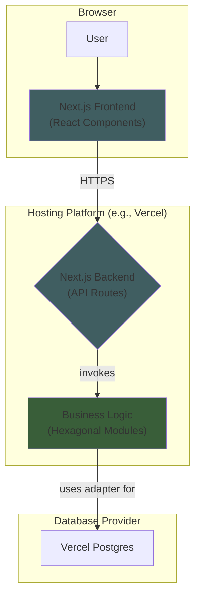
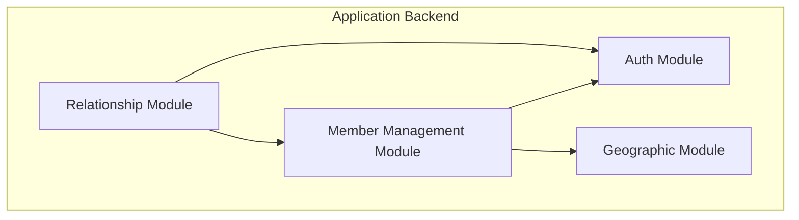

Excellent. Let's proceed with creating the architecture.

We have already established the foundational principles in our Architectural Decision Records (ADRs). The next step is to formalize these into the **High-Level Architecture** section of our document. This section will provide a comprehensive overview of the system's structure and the core patterns that will guide its development.

Here is the drafted section for your review.

-----

## High-Level Architecture

### Technical Summary

The architecture for `emmaCompanionship` is a unified full-stack application built entirely in **TypeScript**. It leverages the **Next.js framework** for both the frontend (React) and the backend API (API Routes), all managed within a single **Monorepo**. The backend is designed as a **Modular Monolith**, with each internal module adhering to the **Hexagonal Architecture** pattern to ensure maintainability and future portability. For the POC, the application and its **PostgreSQL** database will be hosted on **Vercel**.

### Platform and Infrastructure Choice

  * **Platform**: The application is a self-contained, full-stack Next.js application. For the initial POC, it will be hosted on **Vercel's Hobby tier**.
  * **Database**: We will use **Vercel Postgres**, also on the Hobby tier.
  * **Deployment Regions**: A single region will be sufficient for the POC (e.g., Western Europe). 
  * **Key Features**: This provides a no-cost, scalable, and secure environment with automated backups (Point-in-Time Recovery) and custom domain support.

### Repository Structure

  * **Structure**: **Monorepo**. This structure simplifies dependency management and allows for easy code and type sharing between the frontend, backend, and any other packages.

### High-Level Architecture Diagram



### Architectural Patterns

  * **Modular Monolith**: The backend, while deployed as a single unit, will be internally organized into distinct modules (e.g., "Members", "Relationships").
  * **Hexagonal Architecture (Ports & Adapters)**: Each module's core business logic is isolated from external concerns (the database, frameworks), making it reusable and independently testable.
  * **Serverless API**: The Next.js backend API will be deployed as serverless functions, providing excellent scalability and cost-efficiency.

-----

## Tech Stack

| Category | Technology | Version | Purpose | Rationale |
| :--- | :--- | :--- | :--- | :--- |
| **Language** | TypeScript | ~5.x | Primary language for entire stack | Ensures type safety across frontend and backend, reducing bugs. |
| **Framework** | Next.js | ~14.x | Full-stack framework for UI and API | Provides a unified, high-performance environment for both client and server. |
| **UI Library** | Tailwind CSS + shadcn/ui | Latest | Styling and UI components | A highly customizable and developer-friendly approach over rigid component libraries. |
| **State Mgt** | Zustand | ~4.x | **UI-only** client-side state management | A simple, lightweight solution for global UI state. |
| **Data Fetching**| **TanStack Query** | **~5.x** | **Server state** management & caching | The industry standard for managing server data, preventing bugs. |
| **API Style** | REST | N/A | API communication standard | Natively supported by Next.js API Routes and universally understood. |
| **Database** | PostgreSQL | 16.x | Primary data storage | A robust, reliable, and scalable open-source relational database. |
| **ORM** | Prisma | ~5.x | Database client and schema mgt | Provides excellent type safety between our database and application code. |
| **Authentication**| Auth.js (NextAuth) | ~5.x | User authentication and session mgt | The de-facto standard for Next.js, providing a secure and simple solution. |
| **Graph Viz** | React Flow | ~11.x | Interactive graph rendering | Modern, feature-rich library for our core drag-and-drop UI. |
| **Testing** | Jest + Playwright | Latest | Unit, integration, and E2E testing | Jest is the standard for JS unit tests; Playwright is a modern E2E testing tool. |
| **Monorepo Tool**| Turborepo | ~1.x | High-performance build system | Optimized for JS/TS monorepos and integrates perfectly with Vercel. |
| **CI/CD** | GitHub Actions | N/A | Continuous integration & deployment | Tightly integrated with GitHub, powerful, and easy to configure. |

-----

## Data Models

###  Architectural Note on Role Management

To provide clarity for the development team, this section details the reasoning behind our role-management data model.

Our initial, simpler models (with flags like `isDelegate` or direct links like `managesUnitId` on the `Member` record) failed to capture two critical business rules:

1.  A member's role (like Delegate or Supervisor) is always tied to a specific **scope** (e.g., a Province, a Zone).
2.  A member's physical location can be **different** from the scope of their role (e.g., a Zone Delegate for "Europe" might live in a specific province in Poland).

The chosen design solves this by creating a dedicated `RoleAssignment` model. This model acts as a link, explicitly connecting a **Member** to a **Role** for a specific **Scope** (`GeographicUnit`). This approach is highly flexible, accurately models the community's structure, and is the key to correctly implementing complex features like automated supervision and the "power separation" rule.

```typescript
// A branded type for UUIDs to enforce type-safety
export type UUID = string & { readonly __brand: 'UUID' };
```

###  GeographicUnit

**Purpose**: Defines the organizational and geographical tree structure of the community.

**TypeScript Interface**:

```typescript
interface GeographicUnit {
  id: UUID;
  name: string; // e.g., "Cracow Area", "Poland South Province"
  type: 'sector' | 'province' | 'country' | 'zone' | 'community';
  parentId?: UUID; // Foreign Key to another GeographicUnit
}
```

###  Member

**Purpose**: The central entity representing an individual person within the community. This model is intentionally kept simple, with all role and leadership information handled by the `RoleAssignment` model.

**TypeScript Interface**:

```typescript
interface Member {
  id: UUID;
  firstName: string;
  lastName: string;
  gender: 'male' | 'female';
  maritalStatus: 'single' | 'married' | 'widowed' | 'consecrated';
  communityEngagementStatus: 'Looker-On' | 'In-Probation' | 'Commited' | 'In-Fraternity-Probation' | 'Fraternity';
  accompanyingReadiness: 'Not Candidate' | 'Candidate' | 'Ready' | 'Active' | 'Overwhelmed' | 'Deactivated';
  languages: string[];
  geographicUnitId: UUID; // The unit they BELONG to.

  // Optional fields
  email?: string;
  phone?: string;
  dateOfBirth?: Date;
  imageUrl?: string;
  notes?: string;
  consecratedStatus?: 'priest' | 'deacon' | 'seminarian' | 'sister' | 'brother';
  coupleId?: UUID;
}
```

###  Couple

**Purpose**: Groups two `Member` entities so they can be treated as a single unit.

**TypeScript Interface**:

```typescript
interface Couple {
  id: UUID;
  member1Id: UUID; // Foreign Key to Member
  member2Id: UUID; // Foreign Key to Member
  weddingDate?: Date;
  numberOfChildren?: number;
}
```

###  Role & RoleAssignment

**Purpose**: A flexible system to assign roles (like Supervisor or Delegate) to Members with a specific geographical scope.

**TypeScript Interfaces**:

```typescript
interface Role {
  id: UUID;
  name: 'Companionship Delegate' | 'Supervisor' | 'Admin'; 
  level: 'sector' | 'province' | 'country' | 'zone' | 'international';
}

interface RoleAssignment {
  id: UUID;
  memberId: UUID;   // Foreign Key to the Member
  roleId: UUID;     // Foreign Key to the Role
  scopeId: UUID;    // Foreign Key to GeographicUnit (the scope of the role)
}
```

###  Companionship, ApprovalProcess & ApprovalStep

**Purpose**: These models manage the lifecycle of a voluntary `Companionship`, including the flexible, multi-step approval workflow.

**TypeScript Interfaces**:

```typescript
interface Companionship {
  id: UUID;
  companionId: UUID;
  companionType: 'member' | 'couple';
  accompaniedId: UUID;
  accompaniedType: 'member' | 'couple';
  status: 'proposed' | 'active' | 'archived';
  healthStatus?: 'green' | 'yellow' | 'red' | 'gray';
  startDate: Date;
  endDate?: Date;
}

interface ApprovalProcess {
  id: UUID;
  companionshipId: UUID;
  status: 'in_progress' | 'approved' | 'rejected';
  steps: ApprovalStep[]; 
}

interface ApprovalStep {
  approverRole: 'province_head' | 'country_head' | 'zone_delegate' | 'zone_delegate_for_priests' | 'zone_delegate_for_consecrated_sisters' | 'zone_companionship_delegate' | 'international_companionship_delegate' | 'general_moderator' | 'companion' | 'accompanied';
  status: 'pending' | 'approved' | 'rejected';
  decisionDate?: Date;
}
```

###  Note on the `Supervision` Model
A dedicated `Supervision` model is not needed. This relationship is implicitly defined by Role, Geography and `Member.geographicUnitId`.
- Member is in some Geographical unit (e.g., Sector).
- Another Member has a Role (Sector Head) that is scoped to that Sector
- Another Member has a Role (Province Head) that is scoped to Province of that Sector
- Another Member has a Role (Country Head) that is scoped to Country of that Province
- and so on...

###  Note on the Companionship Delegates
As for Supervisors, Companionship Delegates responsibility (which Members they take care for) is implicitly defined by Role, Geography and `Member.geographicUnitId`.
- Member is in some Geographical unit (e.g., Province).
- Another Member has a Role Companionship Delegate that is scoped to that Geographical unit
- Another Member has a Role Zone Companionship Delegate that is scoped to Zone where mentioned Province belongs

-----

## Components

Our backend will be composed of the following core modules.

###  Component Interaction Diagram



### 1. Auth Module

  * **Responsibility**: User registration, login, session management, and decoding access tokens to provide user identity.
  * **Key Interfaces**: `registerUser()`, `loginUser()`, `getCurrentUser()`, `decodeToken()`.
  * **Dependencies**: None.

### 2. Geographic Module

  * **Responsibility**: Manages the `GeographicUnit` organizational tree.
  * **Key Interfaces**: `getUnitById(id)`, `getUnitTree()`, `getDescendantUnits(unitId)`.
  * **Dependencies**: None.

### 3. Member Management Module

  * **Responsibility**: Manages the business logic for `Member` and `Couple` entities, and manages `RoleAssignment` records to grant members roles like Supervisor or Delegate.
  * **Key Interfaces**: `getMemberById(id)`, `listMembersByUnit(unitId)`, `createMember(data)`, `updateMember(id, data)`, `assignRoleToMember(memberId, roleId, scopeId)`, `getMemberRoles(memberId)`.
  * **Dependencies**: Depends on `Auth` (for permissions) and `Geographic` (to validate scope).

### 4. Relationship Module

  * **Responsibility**: Manages the entire lifecycle of `Companionship` relationships and the `ApprovalProcess` workflow.
  * **Key Interfaces**: `proposeCompanionship(data)`, `getApprovalProcess(companionshipId)`, `advanceApprovalStep(processId, decision)`, `getGraphDataForUnit(unitId)`.
  * **Dependencies**: Depends on `Auth` and `Member Management` (which contains role info) to perform its complex rule validations.
  * **Design Constraint**: For the MVP, the `ApprovalProcess` logic will be built as a distinct, isolated sub-component *within* this module, designed for easy extraction in the future if needed.

-----

## External APIs

For the MVP, there are no required integrations with external third-party APIs for core business logic.
