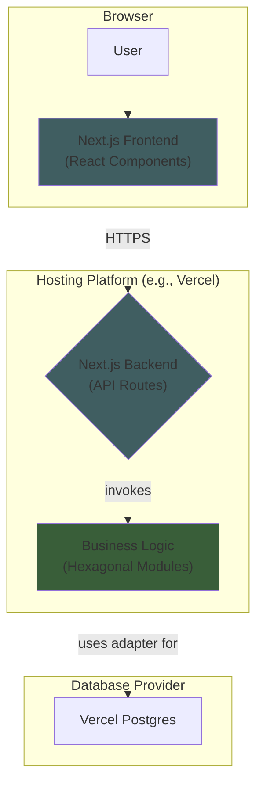

Excellent. Let's proceed with creating the architecture.

We have already established the foundational principles in our Architectural Decision Records (ADRs). The next step is to formalize these into the **High-Level Architecture** section of our document. This section will provide a comprehensive overview of the system's structure and the core patterns that will guide its development.

Here is the drafted section for your review.

-----

## High-Level Architecture

### Technical Summary

The architecture for `emmaCompanionship` is a unified full-stack application built entirely in **TypeScript**. It leverages the **Next.js framework** for both the frontend (React) and the backend API (API Routes), all managed within a single **Monorepo**. The backend is designed as a **Modular Monolith**, with each internal module adhering to the **Hexagonal Architecture** pattern to ensure maintainability and future portability. For the POC, the application and its **PostgreSQL** database will be hosted on **Vercel**.

### Platform and Infrastructure Choice

  * **Platform**: The application is a self-contained, full-stack Next.js application. For the initial POC, it will be hosted on **Vercel's Hobby tier**.
  * **Database**: We will use **Vercel Postgres**, also on the Hobby tier.
  * **Deployment Regions**: A single region will be sufficient for the POC (e.g., Western Europe). 
  * **Key Features**: This provides a no-cost, scalable, and secure environment with automated backups (Point-in-Time Recovery) and custom domain support.

### Repository Structure

  * **Structure**: **Monorepo**. This structure simplifies dependency management and allows for easy code and type sharing between the frontend, backend, and any other packages.

### High-Level Architecture Diagram

### Architectural Patterns

  * **Modular Monolith**: The backend, while deployed as a single unit, will be internally organized into distinct modules (e.g., "Members", "Relationships").
  * **Hexagonal Architecture (Ports & Adapters)**: Each module's core business logic is isolated from external concerns (the database, frameworks), making it reusable and independently testable.
  * **Serverless API**: The Next.js backend API will be deployed as serverless functions, providing excellent scalability and cost-efficiency.

-----

### Rationale

My rationale for this section is to consolidate our decisions from the ADRs into a formal section of the architecture document, centered around a clear visual diagram that shows how all the pieces fit together. This provides a complete overview before we dive into more detailed component designs.

-----
