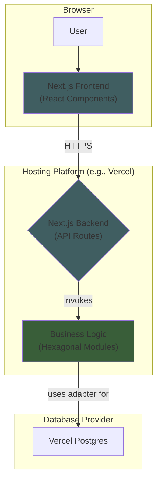

Excellent. Let's proceed with creating the architecture.

We have already established the foundational principles in our Architectural Decision Records (ADRs). The next step is to formalize these into the **High-Level Architecture** section of our document. This section will provide a comprehensive overview of the system's structure and the core patterns that will guide its development.

Here is the drafted section for your review.

-----

## High-Level Architecture

### Technical Summary

The architecture for `emmaCompanionship` is a unified full-stack application built entirely in **TypeScript**. It leverages the **Next.js framework** for both the frontend (React) and the backend API (API Routes), all managed within a single **Monorepo**. The backend is designed as a **Modular Monolith**, with each internal module adhering to the **Hexagonal Architecture** pattern to ensure maintainability and future portability. The initial deployment will be a standalone web application using **PostgreSQL** for data persistence.

### Platform and Infrastructure Choice

  * **Platform**: The application is a self-contained, full-stack Next.js application. For the initial POC, it will be hosted on a platform optimized for this framework, such as Vercel.
  * **Key Services**: The primary infrastructure service will be a managed **PostgreSQL** database.
  * [cite\_start]**Deployment Regions**: A single region will be sufficient for the POC (e.g., Western Europe). [cite: 760]

### Repository Structure

  * **Structure**: **Monorepo**. [cite\_start]This structure simplifies dependency management and code sharing between the frontend and backend. [cite: 904]
  * [cite\_start]**Package Organization**: The monorepo will contain separate packages for the `web` application (frontend and backend logic) and any `shared` code, such as TypeScript types. [cite: 972]

### High-Level Architecture Diagram

### Architectural Patterns

  * **Modular Monolith**: The backend, while deployed as a single unit, will be internally organized into distinct modules (e.g., "Members", "Relationships"). [cite\_start]This prevents code entanglement and improves maintainability. [cite: 909]
  * **Hexagonal Architecture (Ports & Adapters)**: Each module's core business logic will be isolated from external concerns like the database or framework. [cite\_start]This is the key to making our logic reusable and testable, enabling a potential future pivot to SPFx. [cite: 909]
  * [cite\_start]**Serverless API**: The Next.js backend API will be deployed as serverless functions, providing excellent scalability and cost-efficiency. [cite: 754]

-----

### Rationale

My rationale for this section is to formalize the foundational decisions we made in our ADR discussion. The diagram provides a clear visual map of the system, while the pattern descriptions establish the core principles that will guide all subsequent, more detailed design work.

-----

