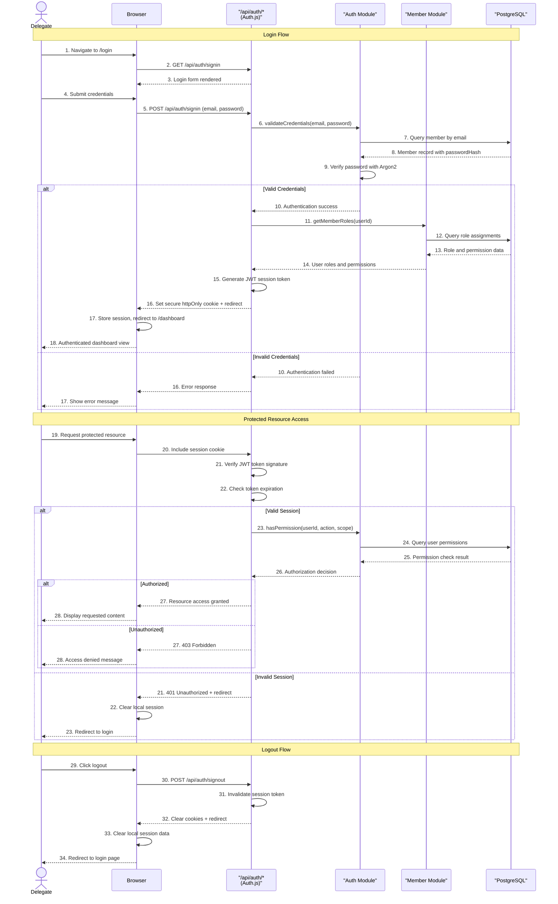

# Backend Architecture

This section defines backend-specific architecture details for our Next.js serverless API implementation, including service organization, database access patterns, and authentication strategies.

## Service Architecture

Our backend follows a serverless architecture using Next.js API routes deployed as Vercel serverless functions, organized into modular business domains with clean separation of concerns.

### Function Organization

```
apps/web/src/app/api/                    # Next.js API routes (serverless functions)
├── auth/
│   └── [...nextauth]/
│       └── route.ts                     # Auth.js configuration and handlers
│
├── members/                             # Member management endpoints
│   ├── route.ts                         # GET /api/members, POST /api/members
│   ├── search/
│   │   └── route.ts                     # GET /api/members/search
│   ├── export/
│   │   └── route.ts                     # POST /api/members/export
│   ├── import/
│   │   ├── analyze/
│   │   │   └── route.ts                 # POST /api/members/import/analyze
│   │   └── execute/
│   │       └── route.ts                 # POST /api/members/import/execute
│   └── [id]/                            # Dynamic member routes
│       ├── route.ts                     # GET, PUT, DELETE /api/members/{id}
│       ├── roles/
│       │   └── route.ts                 # GET, POST /api/members/{id}/roles
│       ├── eligible-companions/
│       │   └── route.ts                 # GET /api/members/{id}/eligible-companions
│       └── companionships/
│           └── route.ts                 # GET /api/members/{id}/companionships
│
├── companionships/                      # Companionship management endpoints
│   ├── route.ts                         # GET /api/companionships, POST /api/companionships
│   ├── direct/
│   │   └── route.ts                     # POST /api/companionships/direct (skip approval)
│   ├── reassign/
│   │   └── route.ts                     # POST /api/companionships/reassign
│   ├── wizard/
│   │   └── route.ts                     # POST /api/companionships/wizard
│   └── [id]/                            # Dynamic companionship routes
│       ├── route.ts                     # GET, PUT, DELETE /api/companionships/{id}
│       ├── health/
│       │   └── route.ts                 # PATCH /api/companionships/{id}/health
│       ├── approval/
│       │   └── route.ts                 # GET, POST /api/companionships/{id}/approval
│       └── archive/
│           └── route.ts                 # POST /api/companionships/{id}/archive
│
├── graph/                               # Graph visualization endpoints
│   └── [unitId]/
│       ├── route.ts                     # GET /api/graph/{unitId} (graph data)
│       └── layout/
│           └── route.ts                 # GET, PATCH /api/graph/{unitId}/layout
│
├── geographic/                          # Geographic unit endpoints
│   ├── route.ts                         # GET /api/geographic (units tree)
│   ├── [id]/
│   │   └── route.ts                     # GET /api/geographic/{id}
│   └── units/
│       ├── descendants/
│       │   └── [id]/
│       │       └── route.ts             # GET /api/geographic/units/descendants/{id}
│       └── ancestors/
│           └── [id]/
│               └── route.ts             # GET /api/geographic/units/ancestors/{id}
│
├── roles/                               # Role management endpoints
│   ├── route.ts                         # GET /api/roles
│   └── [id]/
│       └── route.ts                     # GET /api/roles/{id}
│
└── health/                              # Health check and monitoring
    └── route.ts                         # GET /api/health
```

**Function Organization Principles:**

1. **Resource-Based Routing:** API routes follow RESTful resource patterns
2. **Nested Resources:** Hierarchical relationships reflected in URL structure
3. **Business Domain Grouping:** Functions organized by business capability
4. **Single Responsibility:** Each route handles one specific operation
5. **Serverless Optimization:** Stateless functions with minimal cold start overhead

### Function Template

```typescript
// Example: Complete API route with all modern patterns
// app/api/members/route.ts

import { NextRequest, NextResponse } from 'next/server';
import { z } from 'zod';
import { auth } from '@/lib/auth';
import { memberModule } from '@/lib/modules/memberModule';
import { geographicModule } from '@/lib/modules/geographicModule';
import { authModule } from '@/lib/modules/authModule';
import { 
  CreateMemberRequestSchema, 
  MemberFiltersSchema,
  ApiResponse,
  ApiError 
} from '@/packages/shared-types';
import { prisma } from '@/lib/prisma';

// Input validation schemas
const GetMembersQuerySchema = z.object({
  unitId: z.string().uuid(),
  page: z.coerce.number().min(1).default(1),
  limit: z.coerce.number().min(1).max(100).default(50),
  search: z.string().optional(),
  gender: z.enum(['male', 'female']).optional(),
  maritalStatus: z.enum(['single', 'married', 'widowed', 'consecrated']).optional(),
  accompanyingReadiness: z.enum(['Not Candidate', 'Candidate', 'Ready', 'Active', 'Overwhelmed', 'Deactivated']).optional(),
});

// GET /api/members - List members with filtering and pagination
export async function GET(request: NextRequest) {
  try {
    // 1. Authentication & Session Management
    const session = await auth();
    if (!session?.user) {
      return NextResponse.json(
        { error: 'Authentication required', code: 'UNAUTHORIZED' },
        { status: 401 }
      );
    }

    // 2. Input Validation
    const { searchParams } = new URL(request.url);
    const queryParams = Object.fromEntries(searchParams);
    
    const validatedQuery = GetMembersQuerySchema.safeParse(queryParams);
    if (!validatedQuery.success) {
      return NextResponse.json(
        { 
          error: 'Invalid query parameters', 
          code: 'VALIDATION_ERROR',
          details: validatedQuery.error.issues 
        },
        { status: 400 }
      );
    }

    const { unitId, page, limit, ...filters } = validatedQuery.data;

    // 3. Authorization Checks
    const hasPermission = await authModule.hasPermission(
      session.user.id, 
      'read_members', 
      unitId
    );
    
    if (!hasPermission) {
      return NextResponse.json(
        { error: 'Insufficient permissions', code: 'FORBIDDEN' },
        { status: 403 }
      );
    }

    // 4. Geographic Scope Validation
    const validScope = await geographicModule.validateUserScope(
      session.user.id, 
      unitId
    );
    
    if (!validScope) {
      return NextResponse.json(
        { error: 'Invalid geographic scope', code: 'INVALID_SCOPE' },
        { status: 403 }
      );
    }

    // 5. Business Logic Execution
    const result = await memberModule.getMembers(unitId, filters, page, limit);

    // 6. Response Formatting
    const response: ApiResponse<typeof result> = {
      data: result,
      meta: {
        page,
        limit,
        total: result.total,
        totalPages: Math.ceil(result.total / limit),
      },
      timestamp: new Date().toISOString(),
    };

    return NextResponse.json(response);

  } catch (error) {
    // 7. Error Handling
    console.error('GET /api/members error:', error);

    if (error instanceof ApiError) {
      return NextResponse.json(
        { error: error.message, code: error.code },
        { status: error.status }
      );
    }

    return NextResponse.json(
      { error: 'Internal server error', code: 'INTERNAL_ERROR' },
      { status: 500 }
    );
  }
}

// POST /api/members - Create new member
export async function POST(request: NextRequest) {
  try {
    // 1. Authentication
    const session = await auth();
    if (!session?.user) {
      return NextResponse.json(
        { error: 'Authentication required', code: 'UNAUTHORIZED' },
        { status: 401 }
      );
    }

    // 2. Input Validation
    const body = await request.json();
    const validatedData = CreateMemberRequestSchema.safeParse(body);
    
    if (!validatedData.success) {
      return NextResponse.json(
        { 
          error: 'Invalid member data', 
          code: 'VALIDATION_ERROR',
          details: validatedData.error.issues 
        },
        { status: 400 }
      );
    }

    const memberData = validatedData.data;

    // 3. Authorization
    const hasPermission = await authModule.hasPermission(
      session.user.id, 
      'create_members', 
      memberData.geographicUnitId
    );
    
    if (!hasPermission) {
      return NextResponse.json(
        { error: 'Insufficient permissions to create members', code: 'FORBIDDEN' },
        { status: 403 }
      );
    }

    // 4. Business Logic with Transaction
    const member = await prisma.$transaction(async (tx) => {
      // Validate business constraints
      await memberModule.validateMemberConstraints(memberData, tx);
      
      // Create member
      return await memberModule.createMember(memberData, tx);
    });

    // 5. Success Response
    const response: ApiResponse<typeof member> = {
      data: member,
      timestamp: new Date().toISOString(),
    };

    return NextResponse.json(response, { status: 201 });

  } catch (error) {
    console.error('POST /api/members error:', error);

    if (error instanceof ApiError) {
      return NextResponse.json(
        { error: error.message, code: error.code },
        { status: error.status }
      );
    }

    return NextResponse.json(
      { error: 'Failed to create member', code: 'CREATION_FAILED' },
      { status: 500 }
    );
  }
}

// OPTIONS - CORS preflight for browser requests
export async function OPTIONS() {
  return new NextResponse(null, {
    status: 200,
    headers: {
      'Access-Control-Allow-Origin': '*',
      'Access-Control-Allow-Methods': 'GET, POST, PUT, DELETE, OPTIONS',
      'Access-Control-Allow-Headers': 'Content-Type, Authorization',
    },
  });
}
```

**Serverless Function Features:**

1. **Stateless Design:** No server state, all data from database/external services
2. **Edge Optimization:** Deployed to Vercel Edge Network for global performance
3. **Auto-Scaling:** Automatic scaling based on request volume
4. **Cold Start Optimization:** Minimal dependencies and lazy loading
5. **Transaction Support:** Database transactions for data consistency
6. **Type Safety:** End-to-end TypeScript with shared schemas
7. **Error Boundaries:** Comprehensive error handling with proper HTTP status codes
8. **Security Layers:** Authentication, authorization, and input validation

## Database Architecture

Our database architecture leverages PostgreSQL as the primary data store with Prisma as the ORM, implementing repository patterns and optimized access patterns for our serverless environment.

### Schema Design

The database schema is already comprehensively documented in the Database Schema section above. The key design principles for our serverless architecture include:

**Performance Optimizations:**
- **Connection Pooling:** Prisma connection pool optimized for serverless functions
- **Query Optimization:** Strategic indexes on frequently queried fields
- **Batch Operations:** Efficient bulk operations for data import/export
- **Read Replicas:** Potential for read scaling with Vercel Postgres

**Serverless Considerations:**
- **Connection Management:** Prisma handles connection lifecycle for short-lived functions
- **Cold Start Mitigation:** Database connections warmed up efficiently
- **Transaction Boundaries:** Clear transaction scopes for data consistency

### Data Access Layer

```typescript
// lib/modules/memberModule.ts - Repository pattern implementation
import { PrismaClient, Prisma } from '@prisma/client';
import { 
  Member, 
  CreateMemberRequest, 
  UpdateMemberRequest, 
  MemberFilters,
  PaginatedResponse 
} from '@/packages/shared-types';
import { ApiError } from '@/lib/errors';

// Prisma singleton for serverless optimization
import { prisma } from '@/lib/prisma';

export class MemberRepository {
  constructor(private db: PrismaClient = prisma) {}

  // ===============================
  // Query Methods
  // ===============================

  async findMany(
    unitId: string,
    filters: MemberFilters = {},
    page = 1,
    limit = 50,
    tx?: Prisma.TransactionClient
  ): Promise<PaginatedResponse<Member>> {
    const db = tx || this.db;
    
    // Build dynamic where clause
    const where: Prisma.MemberWhereInput = {
      geographicUnitId: unitId,
      ...this.buildFilterClause(filters),
    };

    // Execute count and data queries in parallel
    const [total, members] = await Promise.all([
      db.member.count({ where }),
      db.member.findMany({
        where,
        include: {
          geographicUnit: true,
          couple: true,
          roleAssignments: {
            include: {
              role: true,
              scope: true,
            },
          },
        },
        orderBy: [
          { lastName: 'asc' },
          { firstName: 'asc' },
        ],
        skip: (page - 1) * limit,
        take: limit,
      }),
    ]);

    return {
      data: members as Member[],
      total,
      page,
      limit,
    };
  }

  async findById(
    id: string,
    tx?: Prisma.TransactionClient
  ): Promise<Member | null> {
    const db = tx || this.db;
    
    const member = await db.member.findUnique({
      where: { id },
      include: {
        geographicUnit: true,
        couple: true,
        roleAssignments: {
          include: {
            role: true,
            scope: true,
          },
        },
        asCompanion: {
          include: {
            accompanied: true,
          },
        },
        asAccompanied: {
          include: {
            companion: true,
          },
        },
      },
    });

    return member as Member | null;
  }

  async searchByText(
    query: string,
    unitId?: string,
    limit = 20,
    tx?: Prisma.TransactionClient
  ): Promise<Member[]> {
    const db = tx || this.db;
    
    const where: Prisma.MemberWhereInput = {
      ...(unitId && { geographicUnitId: unitId }),
      OR: [
        { 
          firstName: { 
            contains: query, 
            mode: 'insensitive' 
          } 
        },
        { 
          lastName: { 
            contains: query, 
            mode: 'insensitive' 
          } 
        },
        { 
          email: { 
            contains: query, 
            mode: 'insensitive' 
          } 
        },
      ],
    };

    const members = await db.member.findMany({
      where,
      include: {
        geographicUnit: true,
      },
      orderBy: {
        _relevance: {
          fields: ['firstName', 'lastName'],
          search: query,
          sort: 'desc',
        },
      },
      take: limit,
    });

    return members as Member[];
  }

  // ===============================
  // Mutation Methods
  // ===============================

  async create(
    data: CreateMemberRequest,
    tx?: Prisma.TransactionClient
  ): Promise<Member> {
    const db = tx || this.db;
    
    try {
      const member = await db.member.create({
        data: {
          ...data,
          passwordHash: await this.hashPassword(data.password),
        },
        include: {
          geographicUnit: true,
        },
      });

      return member as Member;
    } catch (error) {
      if (error instanceof Prisma.PrismaClientKnownRequestError) {
        if (error.code === 'P2002') {
          throw new ApiError('Email already exists', 409, 'DUPLICATE_EMAIL');
        }
      }
      throw error;
    }
  }

  async update(
    id: string,
    data: UpdateMemberRequest,
    tx?: Prisma.TransactionClient
  ): Promise<Member> {
    const db = tx || this.db;
    
    try {
      const updateData: any = { ...data };
      
      // Hash password if provided
      if (data.password) {
        updateData.passwordHash = await this.hashPassword(data.password);
        delete updateData.password;
      }

      const member = await db.member.update({
        where: { id },
        data: updateData,
        include: {
          geographicUnit: true,
          roleAssignments: {
            include: {
              role: true,
              scope: true,
            },
          },
        },
      });

      return member as Member;
    } catch (error) {
      if (error instanceof Prisma.PrismaClientKnownRequestError) {
        if (error.code === 'P2025') {
          throw new ApiError('Member not found', 404, 'MEMBER_NOT_FOUND');
        }
      }
      throw error;
    }
  }

  async delete(
    id: string,
    tx?: Prisma.TransactionClient
  ): Promise<void> {
    const db = tx || this.db;
    
    try {
      // Soft delete by updating a deletedAt timestamp
      await db.member.update({
        where: { id },
        data: {
          deletedAt: new Date(),
          email: null, // Clear email to allow reuse
        },
      });
    } catch (error) {
      if (error instanceof Prisma.PrismaClientKnownRequestError) {
        if (error.code === 'P2025') {
          throw new ApiError('Member not found', 404, 'MEMBER_NOT_FOUND');
        }
      }
      throw error;
    }
  }

  // ===============================
  // Business Logic Methods
  // ===============================

  async validateConstraints(
    data: CreateMemberRequest | UpdateMemberRequest,
    tx?: Prisma.TransactionClient
  ): Promise<void> {
    const db = tx || this.db;
    
    // Check if email is already in use (for create or email update)
    if ('email' in data && data.email) {
      const existing = await db.member.findUnique({
        where: { email: data.email },
      });
      
      if (existing) {
        throw new ApiError('Email already in use', 409, 'DUPLICATE_EMAIL');
      }
    }

    // Validate geographic unit exists
    if ('geographicUnitId' in data && data.geographicUnitId) {
      const unit = await db.geographicUnit.findUnique({
        where: { id: data.geographicUnitId },
      });
      
      if (!unit) {
        throw new ApiError('Invalid geographic unit', 400, 'INVALID_GEOGRAPHIC_UNIT');
      }
    }

    // Additional business rule validations...
  }

  // ===============================
  // Utility Methods
  // ===============================

  private buildFilterClause(filters: MemberFilters): Prisma.MemberWhereInput {
    const where: Prisma.MemberWhereInput = {};

    if (filters.gender) {
      where.gender = filters.gender;
    }

    if (filters.maritalStatus) {
      where.maritalStatus = filters.maritalStatus;
    }

    if (filters.accompanyingReadiness) {
      where.accompanyingReadiness = filters.accompanyingReadiness;
    }

    if (filters.search) {
      where.OR = [
        { firstName: { contains: filters.search, mode: 'insensitive' } },
        { lastName: { contains: filters.search, mode: 'insensitive' } },
        { email: { contains: filters.search, mode: 'insensitive' } },
      ];
    }

    // Exclude soft-deleted members
    where.deletedAt = null;

    return where;
  }

  private async hashPassword(password: string): Promise<string> {
    const { hash } = await import('argon2');
    return hash(password);
  }
}

// Module-level business logic
export const memberModule = {
  repository: new MemberRepository(),

  async getMembers(
    unitId: string,
    filters: MemberFilters = {},
    page = 1,
    limit = 50
  ): Promise<PaginatedResponse<Member>> {
    return this.repository.findMany(unitId, filters, page, limit);
  },

  async getMember(id: string): Promise<Member> {
    const member = await this.repository.findById(id);
    if (!member) {
      throw new ApiError('Member not found', 404, 'MEMBER_NOT_FOUND');
    }
    return member;
  },

  async createMember(
    data: CreateMemberRequest,
    tx?: Prisma.TransactionClient
  ): Promise<Member> {
    await this.repository.validateConstraints(data, tx);
    return this.repository.create(data, tx);
  },

  async updateMember(
    id: string,
    data: UpdateMemberRequest,
    tx?: Prisma.TransactionClient
  ): Promise<Member> {
    await this.repository.validateConstraints(data, tx);
    return this.repository.update(id, data, tx);
  },

  async deleteMember(id: string): Promise<void> {
    return this.repository.delete(id);
  },

  async searchMembers(
    query: string,
    unitId?: string,
    limit = 20
  ): Promise<Member[]> {
    return this.repository.searchByText(query, unitId, limit);
  },

  async validateMemberConstraints(
    data: CreateMemberRequest | UpdateMemberRequest,
    tx?: Prisma.TransactionClient
  ): Promise<void> {
    return this.repository.validateConstraints(data, tx);
  },
};
```

**Data Access Features:**

1. **Repository Pattern:** Clean separation between business logic and data access
2. **Transaction Support:** Proper transaction boundaries for complex operations
3. **Type Safety:** Full TypeScript integration with Prisma generated types
4. **Connection Optimization:** Prisma connection pooling for serverless functions
5. **Error Handling:** Structured error handling with business context
6. **Query Optimization:** Efficient queries with proper indexing strategies
7. **Business Rule Validation:** Centralized constraint validation
8. **Soft Deletes:** Data preservation with logical deletion

## Authentication and Authorization

Our authentication architecture leverages Auth.js (NextAuth) v5 for session management with JWT tokens and implements fine-grained role-based access control throughout the application.

### Auth Flow



### Middleware/Guards

```typescript
// middleware.ts - Global authentication and authorization middleware
import { withAuth } from 'next-auth/middleware';
import { NextResponse } from 'next/server';
import type { NextRequest } from 'next/server';

export default withAuth(
  function middleware(req) {
    const { pathname } = req.nextUrl;
    const token = req.nextauth.token;

    // Define route patterns and their required permissions
    const routePermissions = {
      // Public routes (no authentication required)
      public: [
        '/',
        '/login',
        '/register',
        '/forgot-password',
        '/api/health',
      ],
      
      // Admin-only routes
      admin: [
        '/settings/system',
        '/settings/permissions',
        '/api/admin',
      ],
      
      // Delegate routes (requires delegate or admin role)
      delegate: [
        '/dashboard',
        '/members',
        '/companionships',
        '/graph',
        '/import',
        '/reports',
        '/api/members',
        '/api/companionships',
        '/api/graph',
      ],
      
      // User profile routes (any authenticated user)
      authenticated: [
        '/settings/profile',
        '/api/auth',
      ],
    };

    // Check if route is public
    if (routePermissions.public.some(route => 
      pathname === route || pathname.startsWith(route + '/')
    )) {
      return NextResponse.next();
    }

    // Require authentication for all other routes
    if (!token) {
      const loginUrl = new URL('/login', req.url);
      loginUrl.searchParams.set('callbackUrl', pathname);
      return NextResponse.redirect(loginUrl);
    }

    // Check admin routes
    if (routePermissions.admin.some(route => 
      pathname.startsWith(route)
    )) {
      if (!token.roles?.includes('admin')) {
        return NextResponse.redirect(new URL('/dashboard', req.url));
      }
    }

    // Check delegate routes
    if (routePermissions.delegate.some(route => 
      pathname.startsWith(route)
    )) {
      const hasAccess = token.roles?.some(role => 
        ['admin', 'delegate', 'supervisor'].includes(role)
      );
      
      if (!hasAccess) {
        return NextResponse.redirect(new URL('/unauthorized', req.url));
      }
    }

    // Geographic scope validation for API routes
    if (pathname.startsWith('/api/') && token.geographicUnitId) {
      const response = NextResponse.next();
      response.headers.set('X-User-Geographic-Unit', token.geographicUnitId);
      response.headers.set('X-User-Roles', JSON.stringify(token.roles));
      return response;
    }

    return NextResponse.next();
  },
  {
    callbacks: {
      authorized: ({ token }) => {
        // This callback is called for every request
        // Return true to allow the middleware function to run
        return !!token;
      },
    },
    pages: {
      signIn: '/login',
      error: '/auth/error',
    },
  }
);

export const config = {
  matcher: [
    /*
     * Match all request paths except for the ones starting with:
     * - api/auth (auth endpoints handled by Auth.js)
     * - _next/static (static files)
     * - _next/image (image optimization files)
     * - favicon.ico (favicon file)
     * - public folder files
     */
    '/((?!api/auth|_next/static|_next/image|favicon.ico|public).*)',
  ],
};

// lib/auth.ts - Auth.js configuration
import NextAuth from 'next-auth';
import CredentialsProvider from 'next-auth/providers/credentials';
import { PrismaAdapter } from '@auth/prisma-adapter';
import { prisma } from '@/lib/prisma';
import { authModule } from '@/lib/modules/authModule';
import { memberModule } from '@/lib/modules/memberModule';

export const {
  handlers: { GET, POST },
  auth,
  signIn,
  signOut,
} = NextAuth({
  adapter: PrismaAdapter(prisma),
  providers: [
    CredentialsProvider({
      name: 'credentials',
      credentials: {
        email: { label: 'Email', type: 'email' },
        password: { label: 'Password', type: 'password' },
      },
      async authorize(credentials) {
        try {
          if (!credentials?.email || !credentials?.password) {
            return null;
          }

          // Authenticate user
          const user = await authModule.validateCredentials(
            credentials.email,
            credentials.password
          );

          if (!user) {
            return null;
          }

          // Get user roles and permissions
          const roles = await memberModule.getMemberRoles(user.id);
          
          return {
            id: user.id,
            email: user.email,
            name: `${user.firstName} ${user.lastName}`,
            roles: roles.map(r => r.role.name),
            geographicUnitId: user.geographicUnitId,
            permissions: roles.flatMap(r => r.role.permissions || []),
          };
        } catch (error) {
          console.error('Authentication error:', error);
          return null;
        }
      },
    }),
  ],
  session: {
    strategy: 'jwt',
    maxAge: 30 * 24 * 60 * 60, // 30 days
    updateAge: 24 * 60 * 60, // 24 hours
  },
  jwt: {
    maxAge: 30 * 24 * 60 * 60, // 30 days
  },
  callbacks: {
    async jwt({ token, user }) {
      // Persist user data to token
      if (user) {
        token.roles = user.roles;
        token.geographicUnitId = user.geographicUnitId;
        token.permissions = user.permissions;
      }
      return token;
    },
    async session({ session, token }) {
      // Send properties to the client
      if (token) {
        session.user.id = token.sub!;
        session.user.roles = token.roles as string[];
        session.user.geographicUnitId = token.geographicUnitId as string;
        session.user.permissions = token.permissions as string[];
      }
      return session;
    },
  },
  pages: {
    signIn: '/login',
    error: '/auth/error',
  },
  debug: process.env.NODE_ENV === 'development',
});

// lib/modules/authModule.ts - Authentication business logic
import { verify } from 'argon2';
import { prisma } from '@/lib/prisma';
import { ApiError } from '@/lib/errors';
import type { Member } from '@/packages/shared-types';

export const authModule = {
  async validateCredentials(
    email: string, 
    password: string
  ): Promise<Member | null> {
    try {
      const member = await prisma.member.findUnique({
        where: { 
          email: email.toLowerCase(),
          deletedAt: null, // Exclude soft-deleted members
        },
        include: {
          geographicUnit: true,
        },
      });

      if (!member || !member.passwordHash) {
        return null;
      }

      const isValid = await verify(member.passwordHash, password);
      if (!isValid) {
        return null;
      }

      // Don't return password hash
      const { passwordHash, ...memberWithoutPassword } = member;
      return memberWithoutPassword as Member;
      
    } catch (error) {
      console.error('Credential validation error:', error);
      return null;
    }
  },

  async hasPermission(
    userId: string,
    action: string,
    scopeId?: string
  ): Promise<boolean> {
    try {
      const roleAssignments = await prisma.roleAssignment.findMany({
        where: {
          memberId: userId,
          ...(scopeId && { scopeId }),
        },
        include: {
          role: {
            include: {
              permissions: true,
            },
          },
          scope: true,
        },
      });

      // Check if user has the required permission
      const hasDirectPermission = roleAssignments.some(assignment =>
        assignment.role.permissions?.some(perm => perm.name === action)
      );

      if (hasDirectPermission) {
        return true;
      }

      // Check for admin override
      const isAdmin = roleAssignments.some(assignment =>
        assignment.role.name === 'admin'
      );

      if (isAdmin) {
        return true;
      }

      // Check geographic scope hierarchy
      if (scopeId) {
        return this.checkHierarchicalPermission(
          roleAssignments,
          action,
          scopeId
        );
      }

      return false;
    } catch (error) {
      console.error('Permission check error:', error);
      return false;
    }
  },

  private async checkHierarchicalPermission(
    roleAssignments: any[],
    action: string,
    targetScopeId: string
  ): Promise<boolean> {
    // Implementation for checking if user has permission in parent geographic units
    // This allows supervisors at higher levels to manage lower-level units
    
    for (const assignment of roleAssignments) {
      if (assignment.role.permissions?.some((perm: any) => perm.name === action)) {
        // Check if assignment scope is parent of target scope
        const isParentScope = await this.isParentGeographicUnit(
          assignment.scopeId,
          targetScopeId
        );
        
        if (isParentScope) {
          return true;
        }
      }
    }

    return false;
  },

  private async isParentGeographicUnit(
    parentId: string,
    childId: string
  ): Promise<boolean> {
    // Recursive check up the geographic hierarchy
    let currentUnit = await prisma.geographicUnit.findUnique({
      where: { id: childId },
    });

    while (currentUnit?.parentId) {
      if (currentUnit.parentId === parentId) {
        return true;
      }
      
      currentUnit = await prisma.geographicUnit.findUnique({
        where: { id: currentUnit.parentId },
      });
    }

    return false;
  },

  async refreshUserPermissions(userId: string): Promise<{
    roles: string[];
    permissions: string[];
    geographicUnitId: string;
  }> {
    const member = await prisma.member.findUnique({
      where: { id: userId },
      include: {
        roleAssignments: {
          include: {
            role: {
              include: {
                permissions: true,
              },
            },
          },
        },
      },
    });

    if (!member) {
      throw new ApiError('User not found', 404, 'USER_NOT_FOUND');
    }

    const roles = member.roleAssignments.map(assignment => assignment.role.name);
    const permissions = member.roleAssignments.flatMap(assignment =>
      assignment.role.permissions?.map(perm => perm.name) || []
    );

    return {
      roles: [...new Set(roles)], // Remove duplicates
      permissions: [...new Set(permissions)], // Remove duplicates
      geographicUnitId: member.geographicUnitId,
    };
  },
};
```

**Authentication Features:**

1. **JWT-Based Sessions:** Stateless authentication with secure token management
2. **Role-Based Access Control:** Fine-grained permissions with geographic scope
3. **Hierarchical Permissions:** Parent geographic units can manage children
4. **Middleware Protection:** Global route protection with role validation
5. **Session Management:** Automatic token refresh and secure cookie handling
6. **Password Security:** Argon2 hashing with salt for password storage
7. **Audit Trail:** Login attempts and permission checks logged
8. **Security Headers:** CSRF protection and secure cookie configuration

-----
