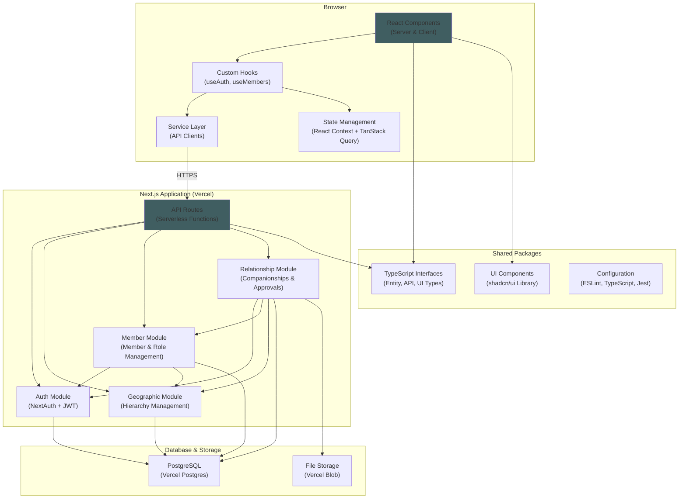
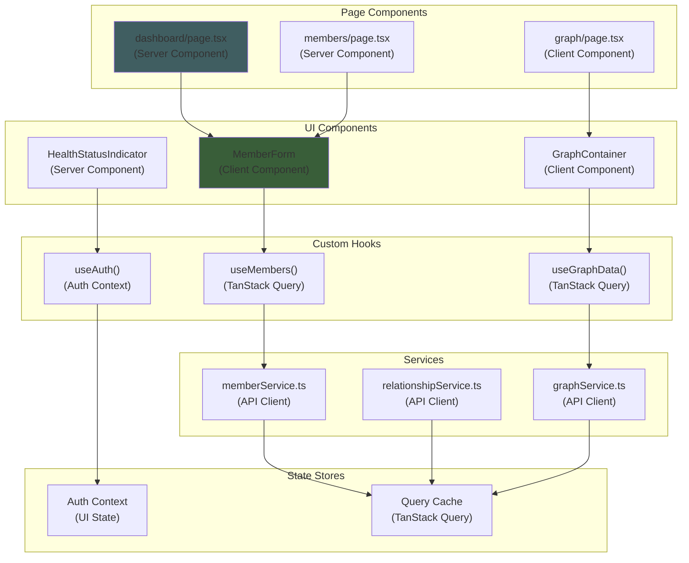
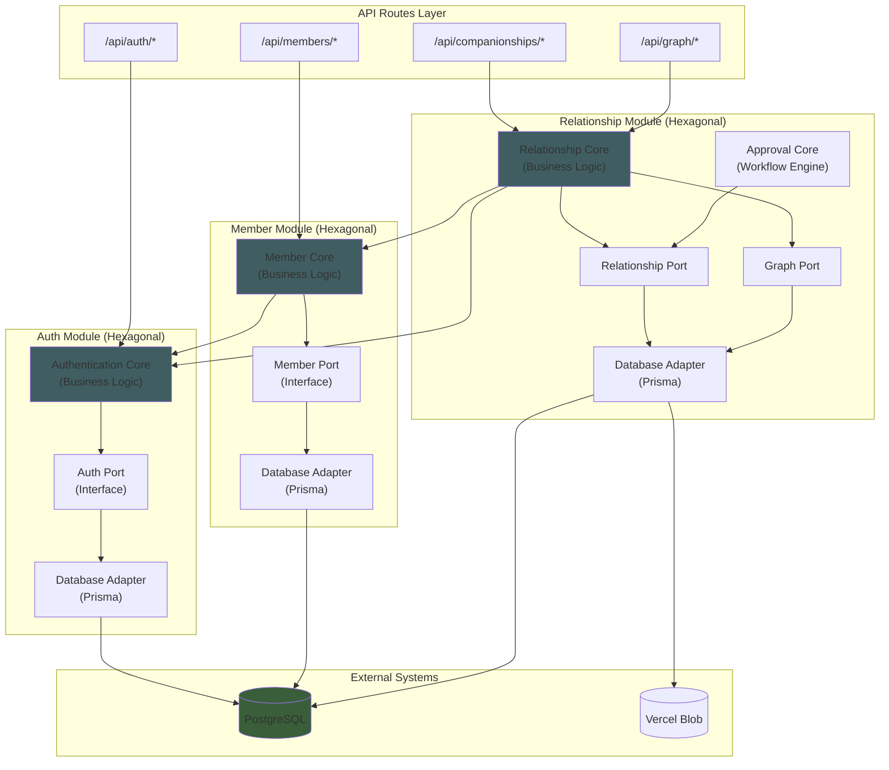

# Components

Based on our fullstack Next.js architecture, the application is organized into frontend and backend components that work together seamlessly within a single deployment unit. The frontend leverages React Server/Client Components with Next.js App Router, while the backend uses our Modular Monolith with Hexagonal patterns.

## Frontend Components

The frontend architecture follows Next.js App Router conventions with clear separation between server and client components, organized by feature and complexity.

### Page Components (`/apps/web/src/app/`)

**Responsibility:** Define application routes and layouts using Next.js App Router with server-side rendering optimization.

**Key Components:**
- `layout.tsx` - Root layout with navigation, authentication provider, and global UI
- `page.tsx` - Home page with authentication redirect and dashboard link
- `dashboard/page.tsx` - Main dashboard with member overview and graph navigation
- `(auth)/login/page.tsx` - Authentication page with Auth.js integration
- `members/page.tsx` - Member list with filtering and search capabilities
- `members/[id]/page.tsx` - Individual member profile and edit functionality
- `graph/page.tsx` - Interactive relationship graph visualization

**Technology Stack:**
- Next.js App Router for file-based routing and server components
- React Server Components for initial page rendering
- TypeScript strict interfaces for page props
- Tailwind CSS for responsive layout styling

### UI Components (`/apps/web/src/components/`)

**Responsibility:** Reusable React components organized by complexity and feature domain.

**Component Hierarchy:**
- `ui/` - Basic shadcn/ui components (Button, Input, Card, Dialog)
- `forms/` - Complex form components (MemberForm, CompanionshipForm, RoleAssignmentForm)
- `graph/` - Graph visualization components (GraphContainer, NodeRenderer, EdgeRenderer, FilterPanel)
- `dashboard/` - Dashboard-specific components (MemberOverview, HealthStatusCards, QuickActions)
- `providers/` - Context providers (AuthProvider, ThemeProvider, QueryProvider)

**Key Interfaces:**
- `<MemberForm onSubmit={handleSubmit} member={member} />` - Member creation/editing
- `<GraphContainer unitId={unitId} filters={filters} />` - Interactive relationship graph
- `<CompanionshipWizard accompaniedId={id} />` - Guided companion assignment
- `<HealthStatusIndicator status={status} lastUpdated={date} />` - Relationship health display

**Technology Stack:**
- React 18 with Server/Client Component separation
- shadcn/ui + Radix UI for accessible component primitives
- React Hook Form + Zod for form validation
- React Flow for graph visualization components
- Tailwind CSS for component styling

### Custom Hooks (`/apps/web/src/hooks/`)

**Responsibility:** Encapsulate data fetching, state management, and complex component logic.

**Key Hooks:**
- `useAuth()` - Authentication state and methods from Auth.js
- `useMembers(unitId, filters)` - Member data fetching with TanStack Query
- `useCompanionships(unitId)` - Relationship data with real-time updates
- `useGraphData(unitId, filters)` - Graph visualization data with caching
- `usePermissions(userId)` - Role-based access control checks
- `useTheme()` - Dark/light mode toggle with persistence

**Technology Stack:**
- TanStack Query for server state management and caching
- React Context for UI-only state management (Zustand planned later)
- Custom hooks for complex business logic
- TypeScript for hook interfaces and return types

### Service Layer (`/apps/web/src/lib/api/`)

**Responsibility:** Frontend API client services that communicate with backend modules through type-safe interfaces.

**Key Services:**
- `authService.ts` - Authentication API calls (login, logout, session)
- `memberService.ts` - Member CRUD operations and search
- `relationshipService.ts` - Companionship management and approval workflows
- `graphService.ts` - Graph data fetching with filtering
- `importService.ts` - Data import analysis and execution

**Service Interfaces:**
- `createMember(data: CreateMemberRequest): Promise<Member>` - Type-safe member creation
- `getEligibleCompanions(memberId: UUID): Promise<{perfectMatches: Member[], softViolations: Member[]}>` - Companion matching
- `updateHealthStatus(companionshipId: UUID, status: HealthStatus): Promise<Companionship>` - Health tracking
- `getGraphData(unitId: UUID, filters: GraphFilters): Promise<GraphResponse>` - Graph visualization

**Technology Stack:**
- Axios/Fetch for HTTP client with interceptors
- Shared TypeScript interfaces from `/packages/shared-types`
- TanStack Query for caching and background updates
- Zod schemas for runtime validation of API responses

## Backend Components

The backend follows Modular Monolith architecture with Hexagonal patterns, organized into four distinct modules with clear boundaries and interfaces.

### Auth Module

**Responsibility:** User registration, login, session management, and decoding access tokens to provide user identity across the entire application.

**Key Interfaces:**
- `registerUser(userData)` - Create new user accounts
- `loginUser(credentials)` - Authenticate users and create sessions
- `getCurrentUser(token)` - Retrieve current user identity
- `decodeToken(jwt)` - Validate and extract user information from tokens
- `hasPermission(userId, action, scope)` - Authorization checks

**Dependencies:** None (foundational module)

**Technology Stack:** 
- Auth.js (NextAuth) v5.x for authentication framework
- JWT tokens for stateless session management
- Prisma ORM for user data persistence
- Argon2 for password hashing
- TypeScript strict mode for type safety

### Geographic Module

**Responsibility:** Manages the `GeographicUnit` organizational tree structure that defines community hierarchy and serves as the foundation for role scoping and member organization.

**Key Interfaces:**
- `getUnitById(id)` - Retrieve specific geographic unit
- `getUnitTree()` - Get complete hierarchical structure
- `getDescendantUnits(unitId)` - Find all child units in hierarchy
- `getAncestorUnits(unitId)` - Get parent chain to root
- `validateUnitScope(childId, parentId)` - Verify hierarchical relationships

**Dependencies:** None (foundational module)

**Technology Stack:**
- Prisma ORM with PostgreSQL for hierarchical data storage
- Recursive SQL queries for tree operations
- TypeScript interfaces for geographic unit types
- Zod schemas for input validation
- Materialized path pattern for efficient tree queries

### Member Management Module

**Responsibility:** Manages business logic for `Member` and `Couple` entities, handles `RoleAssignment` records, and provides member search and filtering capabilities while enforcing community rules.

**Key Interfaces:**
- `getMemberById(id)` - Retrieve individual member details
- `listMembersByUnit(unitId, filters)` - Search members within geographic scope
- `createMember(memberData)` - Add new community members
- `updateMember(id, changes)` - Modify member information
- `assignRoleToMember(memberId, roleId, scopeId)` - Grant roles with geographic scope
- `getMemberRoles(memberId)` - Retrieve all roles for a member
- `validateMemberConstraints(member)` - Enforce business rules

**Dependencies:** 
- Auth Module (for permission validation)
- Geographic Module (for scope validation and hierarchy queries)

**Technology Stack:**
- Prisma ORM with complex relational queries
- PostgreSQL with indexes on foreign keys and search fields
- TypeScript strict interfaces for member data
- Zod schemas for comprehensive input validation
- Business rule engine patterns for constraint validation

### Relationship Module

**Responsibility:** Manages the complete lifecycle of `Companionship` relationships, orchestrates the multi-step `ApprovalProcess` workflow, and provides graph data for visualization while enforcing complex community relationship rules.

**Key Interfaces:**
- `proposeCompanionship(companionData)` - Initiate new companionship proposals
- `getApprovalProcess(companionshipId)` - Retrieve approval workflow status
- `advanceApprovalStep(processId, decision)` - Process approval/rejection decisions
- `getGraphDataForUnit(unitId)` - Generate visualization data for frontend
- `evaluateMatchingConstraints(companionId, accompaniedId)` - Validate relationship rules
- `getCompanionshipHealth(companionshipId)` - Assess relationship status
- `analyzeDataImport(file)` - Parse spreadsheet and detect data structure for import mapping
- `executeDataImport(file, mappings)` - Bulk import complete relational data (members + companionships) from spreadsheet

**Dependencies:** 
- Auth Module (for user identity and permissions)
- Member Management Module (for role information and member data)
- Geographic Module (for scope validation in approval workflows)

**Technology Stack:**
- Prisma ORM with complex transaction management
- PostgreSQL with relationship-specific indexes
- State machine patterns for approval workflow management
- TypeScript union types for status management
- Complex business rule validation engine
- JSON aggregation for graph data generation

**Design Constraint:** The `ApprovalProcess` logic is implemented as an isolated sub-component within this module, designed for easy extraction to a separate service if future requirements demand microservice decomposition.

## Component Integration Patterns

The frontend and backend components work together through well-defined integration patterns that leverage Next.js fullstack capabilities and shared TypeScript interfaces.

### Frontend-Backend Communication Flow

**Pattern:** Frontend services call Next.js API routes, which invoke backend modules through type-safe interfaces.

**Implementation:**
1. **React Component** triggers user action (form submission, button click)
2. **Custom Hook** (useMembers, useCompanionships) manages state and calls service
3. **Service Layer** (memberService.ts) makes HTTP request to API route
4. **Next.js API Route** validates request and calls appropriate backend module
5. **Backend Module** executes business logic and returns data
6. **Response flows back** through the same chain with type safety

**Example Flow:**
```typescript
// Frontend Component
const { mutate: createMember } = useMutation({
  mutationFn: (data: CreateMemberRequest) => memberService.createMember(data),
  onSuccess: () => queryClient.invalidateQueries(['members'])
});

// Service Layer
export const memberService = {
  createMember: async (data: CreateMemberRequest): Promise<Member> => {
    const response = await fetch('/api/members', {
      method: 'POST',
      body: JSON.stringify(data),
      headers: { 'Content-Type': 'application/json' }
    });
    return response.json();
  }
};

// API Route
export async function POST(request: Request) {
  const data = CreateMemberRequestSchema.parse(await request.json());
  const member = await memberModule.createMember(data);
  return NextResponse.json(member);
}
```

### Shared Type Safety Pattern

**Pattern:** TypeScript interfaces from `/packages/shared-types` ensure type safety across the entire stack.

**Implementation:**
- **Shared interfaces** define contracts between frontend and backend
- **API request/response types** prevent frontend-backend mismatches
- **Validation schemas** work on both client and server
- **Component prop types** ensure UI consistency

**Example:**
```typescript
// Shared interface used across stack
interface CreateMemberRequest {
  firstName: string;
  lastName: string;
  gender: 'male' | 'female';
  // ... other fields
}

// Frontend form component
const MemberForm: React.FC<{
  onSubmit: (data: CreateMemberRequest) => Promise<void>;
}> = ({ onSubmit }) => {
  // Type-safe form handling
};

// Backend module
const createMember = async (data: CreateMemberRequest): Promise<Member> => {
  // Type-safe business logic
};
```

### Error Handling Integration

**Pattern:** Errors flow from backend modules through API routes to frontend with consistent formatting.

**Implementation:**
- **Backend modules** throw typed errors with business context
- **API routes** catch errors and format as ApiError responses
- **Frontend services** parse ApiError and trigger appropriate UI feedback
- **UI components** display user-friendly error messages

### State Management Integration

**Pattern:** Frontend state management separates UI state (React Context in POC; Zustand planned later) from server state (TanStack Query).

**Implementation:**
- **TanStack Query** manages all server data with automatic caching and updates
- **React Context providers** handle UI-only state (theme, filters, modals) in POC
- **Custom hooks** combine both for component-level state management
- **Server Components** handle initial data loading

## Component Diagrams

### Fullstack Component Architecture (C4 Container View)



### Frontend Component Data Flow



### Backend Module Interaction (Hexagonal Architecture)



This comprehensive component architecture demonstrates how our fullstack Next.js application integrates frontend React components with backend business modules through type-safe interfaces and clear architectural boundaries. The integration patterns ensure maintainability, scalability, and developer experience while supporting the complex business requirements of the community companionship management system.

-----
