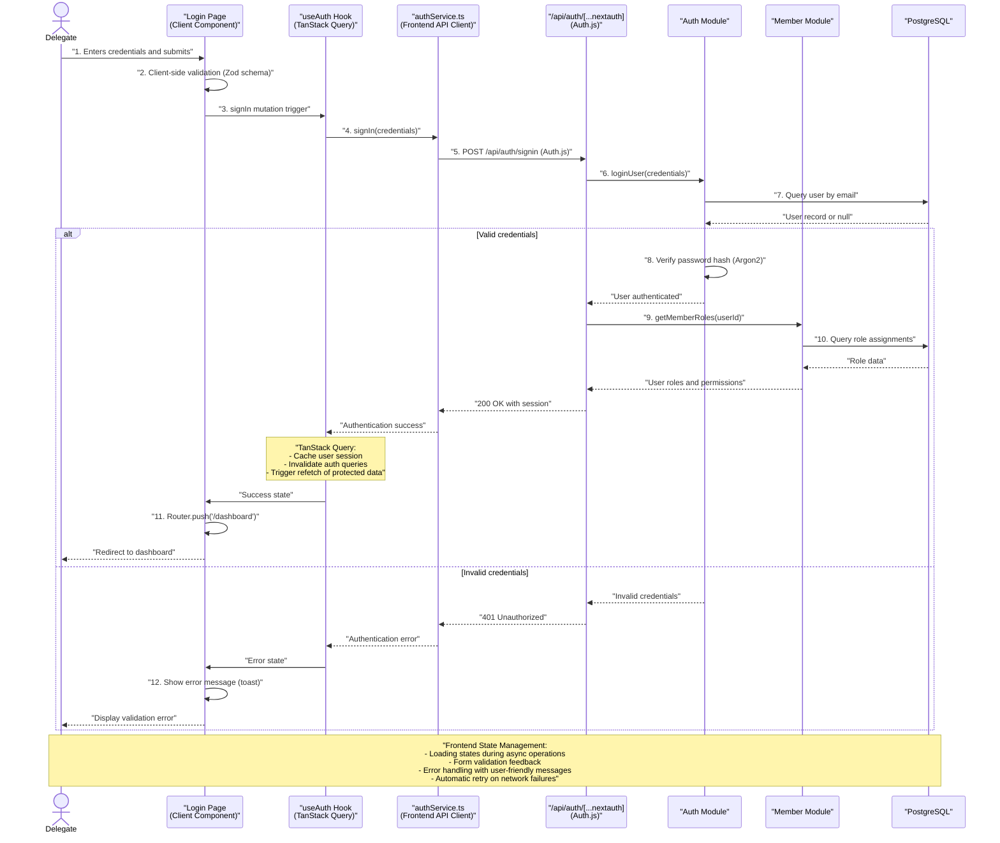
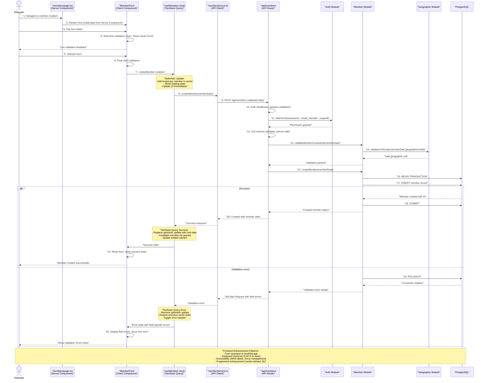
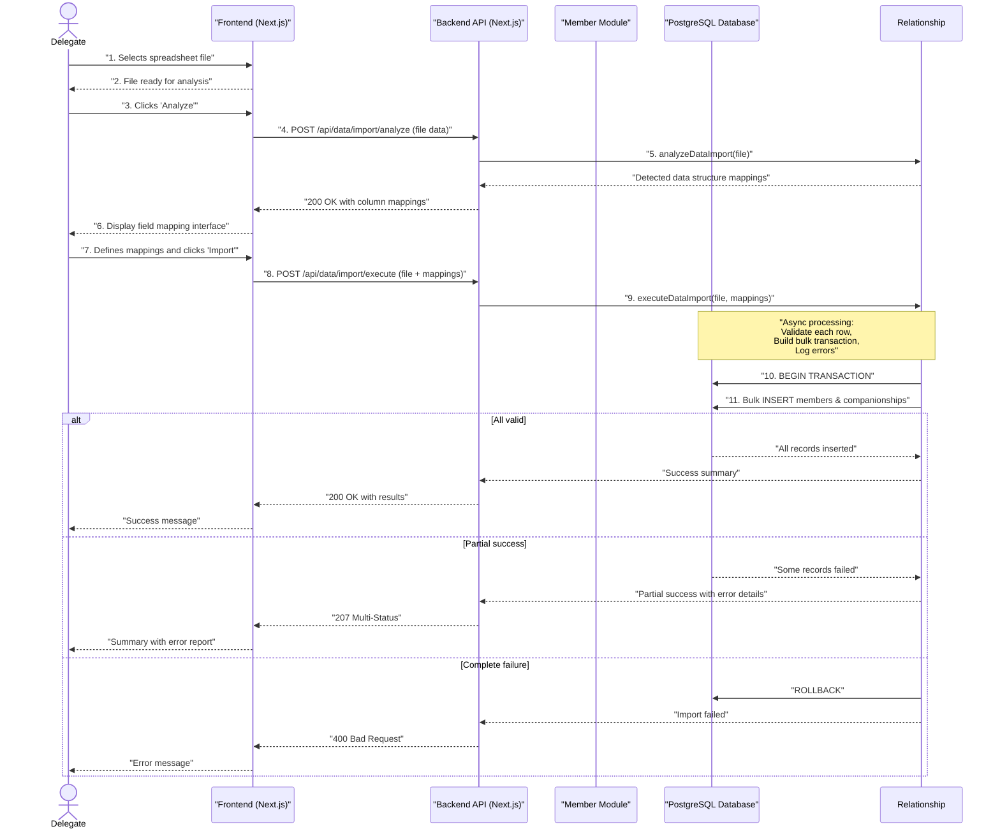
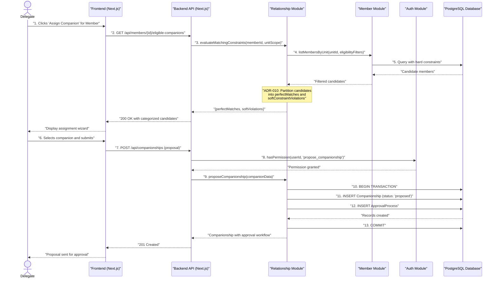
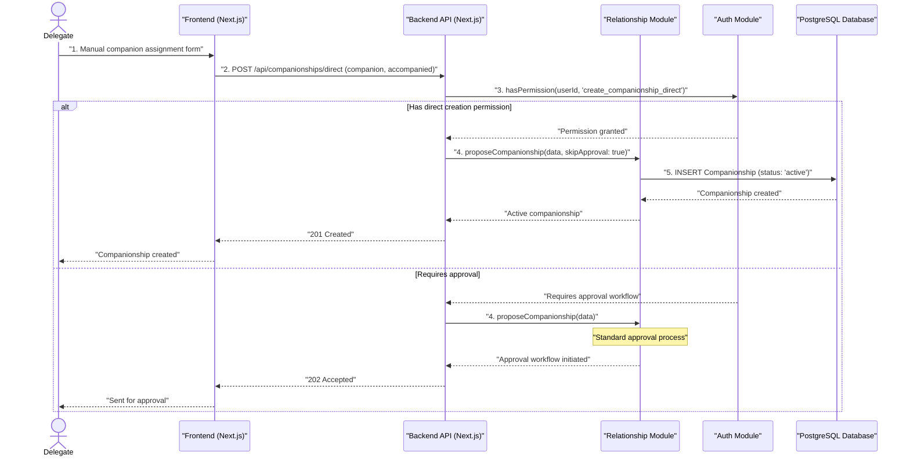
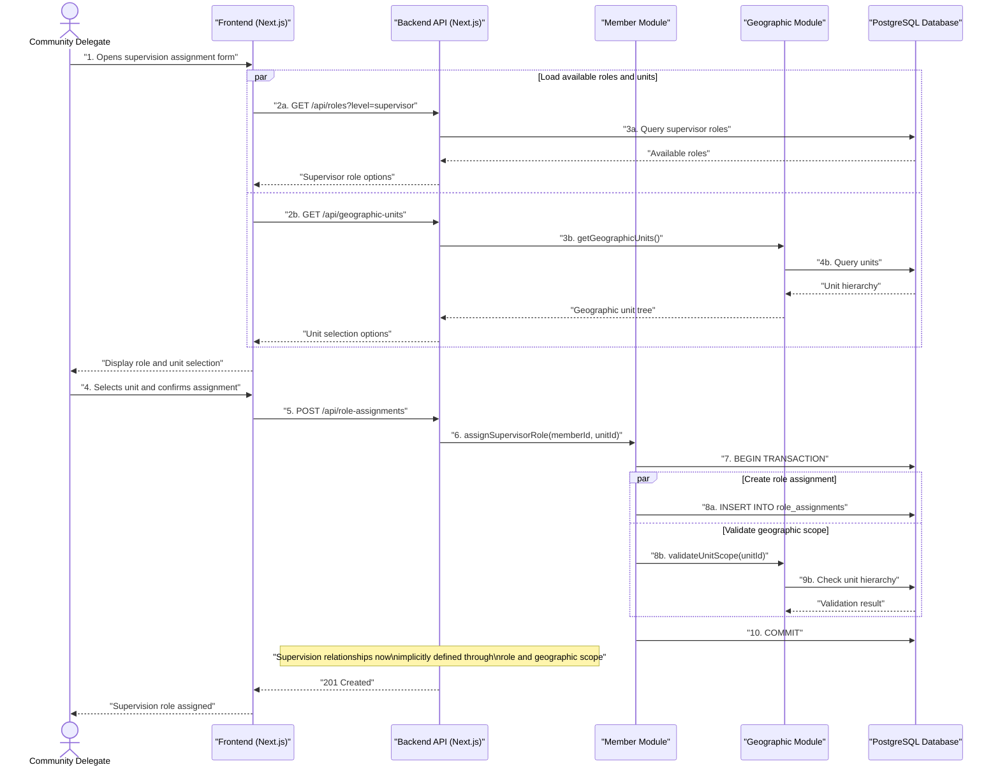
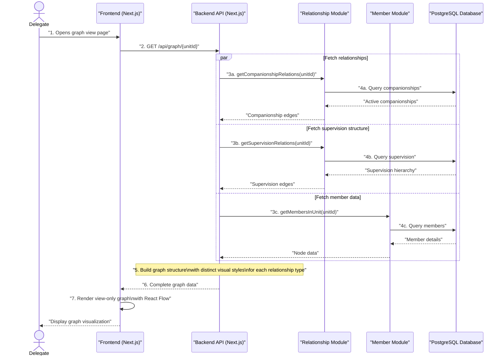
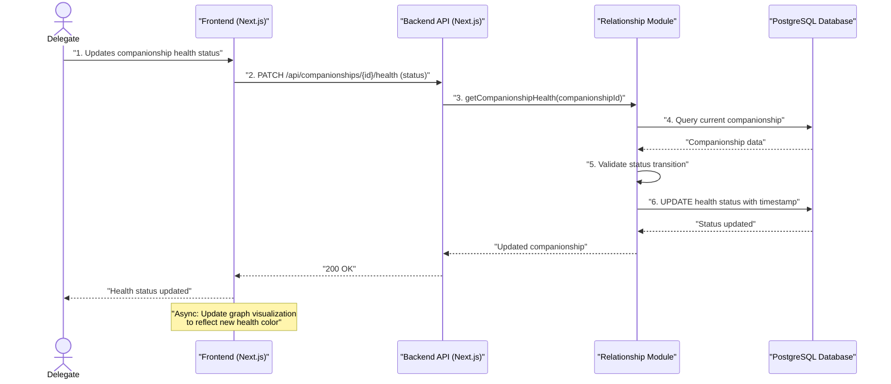
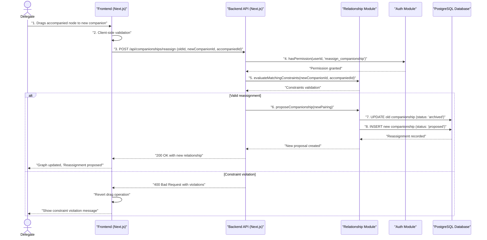
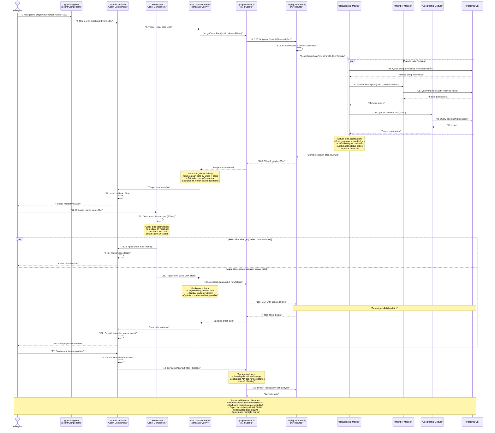

# Core Workflows

This section illustrates key fullstack system workflows using sequence diagrams, showing both frontend and backend component interactions, error handling paths, async operations, and modern React patterns for critical user journeys identified in the PRD.

**Frontend Patterns Included:**
- React Server/Client Component interactions
- TanStack Query state management and cache invalidation
- Form validation and UI state management
- Optimistic updates and real-time synchronization
- Frontend service layer and error handling

**Backend Patterns Included:**
- Next.js API routes and middleware
- Module boundaries and business logic
- Database transactions and error handling
- Permission validation and security

## User Authentication and Authorization Workflow
**PRD Reference:** Story 1.2 - User Authentication & Role Management

This fullstack workflow shows how Delegates securely access the system with React state management, Auth.js integration, and proper frontend-backend coordination.

## Member Creation and Management Workflow
**PRD Reference:** Stories 1.3, 1.4 - Create and Edit Community Members

This fullstack workflow demonstrates member lifecycle management with React Hook Form, Zod validation, optimistic updates, and comprehensive error handling.

## Data Import Workflow
**PRD Reference:** Story 3.1 - Flexible Data Import from CSV/Excel

This stateless workflow enables bulk member import with sophisticated field mapping and error handling.

## Guided Companionship Assignment Workflow
**PRD Reference:** Story 3.2 - Guided Companionship Assignment Wizard

This workflow shows the sophisticated matching algorithm and approval process initiation.

## Manual Companionship Creation Workflow
**PRD Reference:** Story 2.2 - Manually Create and Manage Companionship Relationships

This workflow handles direct companionship creation by authorized Delegates.

## Supervision Role Assignment Workflow
**PRD Reference:** Story 2.3 - Automate Supervision Relationship Management

This workflow demonstrates how Community Delegates (CD) assign supervisory roles to members, which automatically establishes supervision relationships through geographic hierarchy.

Note: Supervision relationships are implicit through the `RoleAssignment` and `GeographicUnit` models. When a member is assigned a supervisory role for a geographic unit:
1. They automatically supervise all members whose `geographicUnitId` belongs to their assigned unit's hierarchy
2. No explicit supervision relationship records are needed
3. The system can determine supervision relationships by querying roles and geographic hierarchy

## Initial Graph View Implementation Workflow

POC Note: This workflow is planned for a later phase (React Flow deferred).
**PRD Reference:** Story 2.4 - V1 Graph View for All Relationships

This workflow shows how the system builds and renders the initial view-only graph visualization of both companionship and supervision relationships.

## Health Status Tracking Workflow
**PRD Reference:** Story 4.1 - Track and Display Relationship Health

This workflow demonstrates health status updates and monitoring.

## Drag-and-Drop Reassignment Workflow

POC Note: This workflow is planned for a later phase (React Flow deferred).
**PRD Reference:** Story 4.2 - "Quick Record" Drag-and-Drop Reassignment

This workflow handles the interactive graph reassignment feature.

## Graph Filtering and Visualization Workflow

POC Note: This advanced visualization is planned for a later phase (React Flow deferred).
**PRD Reference:** Story 4.3 - Graph Filtering Capabilities

This advanced fullstack workflow demonstrates dynamic graph filtering with React Flow, real-time updates, debounced filtering, and sophisticated caching strategies.

-----
