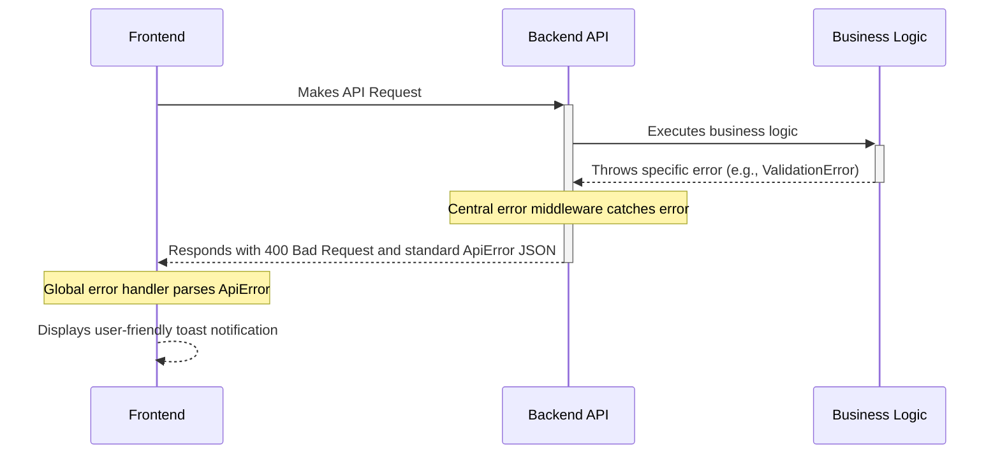

# Error Handling Strategy

This section defines unified error handling across frontend and backend, providing comprehensive guidance for AI and human developers in consistent error management across the entire application stack.

## Error Flow



## Error Response Format

All errors returned from our backend API adhere to this consistent JSON structure:

```typescript
interface ApiError {
  error: {
    code: string; // Machine-readable error code, e.g., 'VALIDATION_FAILED'
    message: string; // User-friendly message for display
    details?: Record<string, any>; // Additional context, e.g., invalid form fields
    timestamp: string; // ISO 8601 timestamp of the error
    correlationId: string; // Unique ID for tracing across multiple subsystems (superior to requestId)
  };
}
```

**Note on correlationId:** We use `correlationId` instead of the template's `requestId` because correlation is a more generic term that allows developer troubleshooting across multiple subsystems, not just HTTP requests.

## Frontend Error Handling

```typescript
// lib/utils/errorHandler.ts
import { toast } from '@/components/ui/use-toast';
import { QueryClient } from '@tanstack/react-query';

export interface ApiError {
  error: {
    code: string;
    message: string;
    details?: Record<string, any>;
    timestamp: string;
    correlationId: string;
  };
}

// Global error handler for TanStack Query
export const globalErrorHandler = (error: unknown, queryClient: QueryClient) => {
  console.error('Global error handler:', error);
  
  if (isApiError(error)) {
    // Handle API errors with structured format
    toast({
      variant: 'destructive',
      title: 'Error',
      description: error.error.message,
      action: error.error.details?.retryable ? (
        <button onClick={() => queryClient.invalidateQueries()}>Retry</button>
      ) : undefined,
    });
    
    // Log with correlation ID for debugging
    console.error(`[${error.error.correlationId}] API Error:`, {
      code: error.error.code,
      message: error.error.message,
      details: error.error.details,
    });
  } else if (error instanceof Error) {
    // Handle generic errors
    toast({
      variant: 'destructive',
      title: 'Unexpected Error',
      description: 'Something went wrong. Please try again.',
    });
    
    console.error('Unexpected error:', error.message);
  }
};

// Type guard for API errors
function isApiError(error: unknown): error is ApiError {
  return (
    typeof error === 'object' &&
    error !== null &&
    'error' in error &&
    typeof (error as any).error.code === 'string'
  );
}

// React Error Boundary Component
import { Component, ReactNode } from 'react';

interface ErrorBoundaryState {
  hasError: boolean;
  error?: Error;
}

export class ErrorBoundary extends Component<
  { children: ReactNode; fallback?: ReactNode },
  ErrorBoundaryState
> {
  constructor(props: any) {
    super(props);
    this.state = { hasError: false };
  }

  static getDerivedStateFromError(error: Error): ErrorBoundaryState {
    return { hasError: true, error };
  }

  componentDidCatch(error: Error, errorInfo: any) {
    console.error('Error Boundary caught error:', error, errorInfo);
    
    // Report to monitoring service in production
    if (process.env.NODE_ENV === 'production') {
      // Integration with error tracking service would go here
    }
  }

  render() {
    if (this.state.hasError) {
      return this.props.fallback || (
        <div className="p-4 border border-red-200 rounded-md">
          <h2 className="text-lg font-semibold text-red-600">Something went wrong</h2>
          <p className="text-sm text-red-500">
            {this.state.error?.message || 'An unexpected error occurred'}
          </p>
          <button 
            onClick={() => this.setState({ hasError: false })}
            className="mt-2 px-3 py-1 bg-red-100 text-red-700 rounded"
          >
            Try Again
          </button>
        </div>
      );
    }

    return this.props.children;
  }
}
```

## Backend Error Handling

```typescript
// lib/middleware/errorHandler.ts
import { NextRequest, NextResponse } from 'next/server';
import { v4 as uuidv4 } from 'uuid';

// Custom error classes
export class AppError extends Error {
  constructor(
    public code: string,
    public userMessage: string,
    public statusCode: number,
    public details?: Record<string, any>,
    public correlationId?: string
  ) {
    super(userMessage);
    this.name = this.constructor.name;
    this.correlationId = correlationId || uuidv4();
  }
}

export class ValidationError extends AppError {
  constructor(message: string, fieldErrors: Record<string, string>, correlationId?: string) {
    super('VALIDATION_FAILED', message, 400, fieldErrors, correlationId);
  }
}

export class NotFoundError extends AppError {
  constructor(resource: string, id: string, correlationId?: string) {
    super('NOT_FOUND', `${resource} not found`, 404, { resource, id }, correlationId);
  }
}

export class PermissionError extends AppError {
  constructor(action: string, resource: string, correlationId?: string) {
    super('PERMISSION_DENIED', `Not authorized to ${action} ${resource}`, 403, { action, resource }, correlationId);
  }
}

// Centralized error handler middleware
export function withErrorHandler<T extends any[]>(
  handler: (...args: T) => Promise<NextResponse>
) {
  return async (...args: T): Promise<NextResponse> => {
    const correlationId = uuidv4();
    
    try {
      // Add correlation ID to request context if it's a NextRequest
      if (args[0] && typeof args[0] === 'object' && 'headers' in args[0]) {
        (args[0] as any).correlationId = correlationId;
      }
      
      return await handler(...args);
    } catch (error) {
      return handleError(error, correlationId);
    }
  };
}

function handleError(error: unknown, correlationId: string): NextResponse {
  if (error instanceof AppError) {
    // Log structured error with correlation ID
    console.error(JSON.stringify({
      level: 'ERROR',
      timestamp: new Date().toISOString(),
      correlationId: error.correlationId || correlationId,
      errorCode: error.code,
      message: error.message,
      statusCode: error.statusCode,
      details: sanitizeErrorDetails(error.details),
      stack: error.stack,
    }));

    return NextResponse.json(
      {
        error: {
          code: error.code,
          message: error.userMessage,
          details: error.details,
          timestamp: new Date().toISOString(),
          correlationId: error.correlationId || correlationId,
        },
      },
      { status: error.statusCode }
    );
  }

  // Handle unexpected errors
  console.error(JSON.stringify({
    level: 'ERROR',
    timestamp: new Date().toISOString(),
    correlationId,
    errorCode: 'INTERNAL_SERVER_ERROR',
    message: error instanceof Error ? error.message : 'Unknown error',
    stack: error instanceof Error ? error.stack : undefined,
  }));

  return NextResponse.json(
    {
      error: {
        code: 'INTERNAL_SERVER_ERROR',
        message: 'An unexpected error occurred',
        timestamp: new Date().toISOString(),
        correlationId,
      },
    },
    { status: 500 }
  );
}

function sanitizeErrorDetails(details: any): any {
  if (!details) return details;
  
  // Remove sensitive information from error details
  const sanitized = { ...details };
  delete sanitized.password;
  delete sanitized.token;
  delete sanitized.secret;
  
  return sanitized;
}

// Example usage in API route
// app/api/members/route.ts
export const POST = withErrorHandler(async (request: NextRequest) => {
  const correlationId = (request as any).correlationId;
  
  try {
    const body = await request.json();
    
    // Validate input
    const validatedData = memberSchema.parse(body);
    
    // Business logic
    const member = await memberModule.createMember(validatedData, correlationId);
    
    return NextResponse.json({ data: member }, { status: 201 });
  } catch (error) {
    if (error instanceof z.ZodError) {
      throw new ValidationError(
        'Invalid member data',
        error.flatten().fieldErrors,
        correlationId
      );
    }
    throw error;
  }
});
```

## Enhanced Error Handling Practices

### Logging Standards
- **Library:** Built-in Node.js console with JSON structured logging for Vercel integration
- **Format:** JSON structured logs with consistent schema for machine parsing and correlation
- **Levels:** ERROR (unrecoverable failures), WARN (handled errors), INFO (request flows), DEBUG (detailed tracing for development)
- **Required Context:**
  - Correlation ID: UUID v4 format (e.g., `550e8400-e29b-41d4-a716-446655440000`) for cross-system tracing
  - Service Context: Module name, function name, and operation type for component identification
  - User Context: Sanitized user identifier (no PII) and session context with automatic PII redaction

```typescript
// Enhanced logging with correlation context
class Logger {
  constructor(private correlationId: string, private service: string) {}
  
  error(message: string, error?: Error, context?: object) {
    console.error(JSON.stringify({
      level: 'ERROR',
      timestamp: new Date().toISOString(),
      correlationId: this.correlationId,
      service: this.service,
      message,
      error: error?.message,
      stack: error?.stack,
      ...this.sanitizeContext(context)
    }));
  }
  
  private sanitizeContext(context: object): object {
    // Automatically redact PII fields (email, phone, etc.)
    return context; // Implementation details for PII redaction
  }
}
```

- **POC Approach:** Leverage Vercel's built-in log aggregation and dashboard for immediate development needs
- **Critical Rule:** All logs must automatically redact sensitive PII to ensure privacy compliance (never store user emails, phone numbers, etc., in plain text logs)

### Error Handling Patterns

**Centralized Middleware at Backend:**
The `withErrorHandler` wrapper (shown above) provides centralized error catching and formatting into standard `ApiError` JSON responses for consistent frontend-backend communication.

**Recovery Strategy:**
Within modules, `try/catch` blocks handle recoverable errors (like retries) internally without exposing them to users, following the principle of graceful degradation.

**External API Errors:**
- **Retry Policy:** Exponential backoff with 3 attempts for 5xx errors, no retry for 4xx client errors
- **Circuit Breaker:** Not implemented for POC (defer to post-POC phase due to minimal external API dependencies)
- **Timeout Configuration:** 30-second timeout for all external HTTP requests with graceful degradation
- **Error Translation:** Map external API errors to internal error codes (e.g., external 401 → internal `EXTERNAL_AUTH_FAILED`)

**Business Logic Errors:**
- **Custom Exceptions:** Structured hierarchy with `ValidationError`, `NotFoundError`, `BusinessRuleError`, `PermissionError` extending base `AppError` class (implemented in Backend Error Handling section above)
- **User-Facing Errors:** All business errors include user-friendly messages suitable for direct display in UI notifications
- **Error Codes:** Hierarchical system with prefixes - `VALIDATION_*`, `NOT_FOUND_*`, `PERMISSION_*`, `BUSINESS_*` for consistent categorization

**Data Consistency:**
- **Transaction Strategy:** Database transactions for multi-table operations with automatic rollback on errors, using Prisma's transaction API
- **Compensation Logic:** Saga pattern for approval workflows - each step includes compensating actions for rollback scenarios
- **Idempotency:** All state-changing API endpoints support idempotency keys to prevent duplicate operations during retries

### Implementation Flow

1. **Business Logic:** Modules throw specific custom errors with correlation context
2. **Centralized Middleware:** `withErrorHandler` catches all errors, logs with full context, formats to ApiError JSON
3. **Frontend Global Handler:** TanStack Query error handling with `globalErrorHandler` parses ApiError and displays user notifications
4. **Error Recovery:** Automatic retry for transient errors, manual retry options for user-recoverable errors
5. **Observability:** Correlation IDs enable instant request tracing from user error reports to server logs across multiple subsystems

-----
