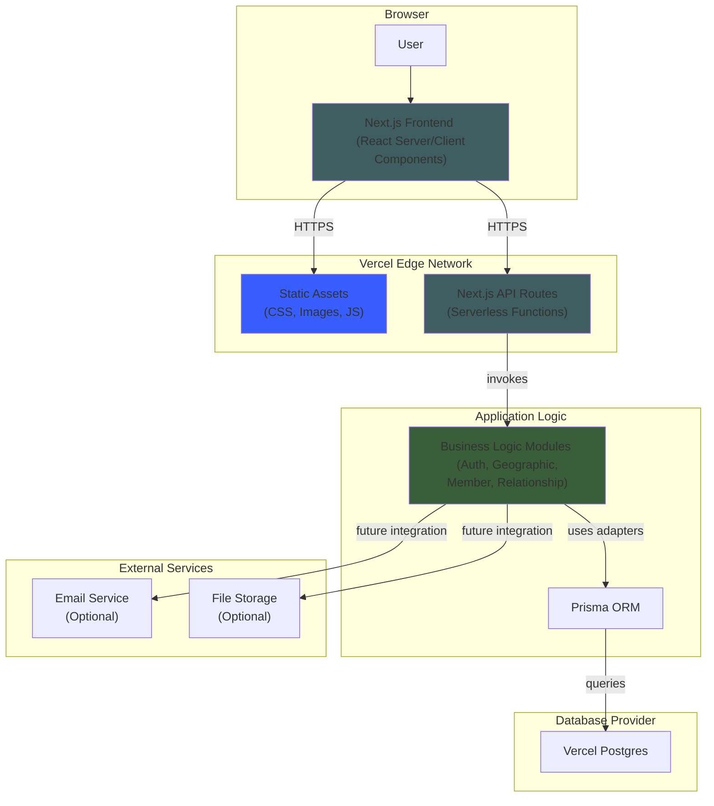

# High Level Architecture

## Technical Summary

The `emmaCompanionship` system employs a **Modular Monolith** architecture style, delivering a unified full-stack TypeScript application via **Next.js** that combines React Server/Client Components with serverless API routes in a single deployment unit. The core architecture features four distinct business modules (Auth, Geographic, Member Management, and Relationship) that interact through well-defined interfaces, with **PostgreSQL** serving as the centralized data layer and **React Flow** powering the interactive relationship graph visualization. The frontend leverages Next.js App Router with Server Components for optimal performance, while the backend uses serverless API routes and Hexagonal Architecture patterns for clean separation of concerns. Primary technology choices center on the **TypeScript/Next.js/Vercel** stack for rapid development and deployment, enabling type-safe fullstack development with shared interfaces between frontend and backend. This architecture directly supports the PRD goals of improving Delegate operational efficiency by providing a scalable, maintainable foundation for complex relationship management workflows, automated constraint enforcement, and visual dashboards that replace manual spreadsheet-based processes.

## High Level Overview

Based on the PRD's Technical Assumptions, the system adopts a **Modular Monolith** architectural style that balances development simplicity with future scalability needs. The **Monorepo** structure enables unified TypeScript type sharing across frontend and backend while maintaining clear module boundaries through Turborepo's workspace management. The service architecture follows a **single-deployment, multi-module** approach where business logic is organized into distinct modules (Auth, Geographic, Member, Relationship) that communicate through well-defined interfaces, preventing code entanglement while avoiding the operational complexity of microservices for the MVP.

The primary user interaction flow centers on Delegates accessing a **React-based dashboard** built with Next.js Server Components for initial page loads and Client Components for interactive elements. Users visualize relationship graphs using React Flow, execute guided workflows (assignment wizard, data import), and perform direct manipulations (drag-and-drop reassignments). These frontend interactions trigger **Next.js API routes** that serve as a Backend-for-Frontend (BFF) layer, making type-safe calls to the appropriate business modules, which then update the PostgreSQL database through Prisma ORM adapters. 

**Key architectural decisions and their rationale** are documented in detail in [Architecture Decision Records (ADRs)](adr.md), including:
- [ADR-001: Unified Technology Stack](adr.md#adr-001-unified-technology-stack) - TypeScript/Next.js for full-stack development
- [ADR-002: Repository Structure](adr.md#adr-002-repository-structure) - Monorepo approach with Turborepo
- [ADR-003: Application and Module Architecture](adr.md#adr-003-application-and-module-architecture) - Modular Monolith with Hexagonal Architecture
- [ADR-004: Database Technology](adr.md#adr-004-database-technology) - PostgreSQL for relational data modeling
- [ADR-005: POC Hosting and Database Platform](adr.md#adr-005-poc-hosting-and-database-platform) - Vercel deployment strategy
- [ADR-006: Graph Visualization Technology](adr.md#adr-006-graph-visualization-technology) - React Flow for interactive graphs
- [ADR-007: Client-Side State Management Strategy](adr.md#adr-007-client-side-state-management-strategy) - Zustand + TanStack Query separation
- [ADR-008: ApprovalProcess Logic Placement](adr.md#adr-008-approvalprocess-logic-placement) - Approval workflow component organization
- [ADR-009: Decoupled Role and Scope Management](adr.md#adr-009-decoupled-role-and-scope-management) - Flexible role assignment architecture
- [ADR-010: Candidate Search with Hard and Soft Constraints](adr.md#adr-010-candidate-search-with-hard-and-soft-constraints) - Constraint-based matching algorithm design
- [ADR-011: Authentication Strategy - Phased Implementation](adr.md#adr-011-authentication-strategy---phased-implementation) - POC manual verification with post-POC OAuth migration

## Platform and Infrastructure Choice

**Options Evaluated:**
1. **Vercel + Vercel Postgres**: Optimized for Next.js, zero-config deployment, integrated database, excellent developer experience
2. **AWS Full Stack**: Enterprise scale with Lambda, API Gateway, RDS, Cognito - offers more control but increased complexity
3. **Azure App Service**: For enterprise Microsoft environments with Azure SQL - good for .NET ecosystems

**Selected Platform:** Vercel + Vercel Postgres

**Rationale:** Perfect alignment with Next.js architecture, zero-configuration deployment pipeline, integrated database with automatic scaling, optimal for MVP rapid development and POC requirements. Vercel's edge network provides global performance while the Hobby tier offers cost-effective hosting for initial validation.

- **Platform:** Vercel
- **Key Services:** Next.js hosting (Edge Network + Serverless Functions), Vercel Postgres, Domain management, Analytics
- **Deployment Regions:** Europe Central/Frankfurt (primary, optimized for Poland), with global edge distribution for static assets
- **Key Features:** No-cost scalable environment with automated backups (Point-in-Time Recovery), custom domain support, and seamless CI/CD integration

## Repository Structure

- **Structure:** Monorepo managed with Turborepo
- **Monorepo Tool:** Turborepo v1.x for high-performance builds and optimal Vercel integration
- **Package Organization:** 
  - `/apps/web` - Next.js fullstack application containing both frontend (App Router) and backend (API routes)
  - `/packages/shared-types` - TypeScript interfaces shared between frontend and backend modules
  - `/packages/ui` - Reusable React components (Button, Card, Form elements)
  - `/packages/config` - Shared configuration (ESLint, TypeScript, Jest configurations)

**Rationale:** Enables unified TypeScript type sharing between frontend and backend, simplifies dependency management, allows code reuse across the stack, and optimizes build performance with Turborepo's intelligent caching. This structure supports our Modular Monolith approach while maintaining clear boundaries between concerns.

## High Level Architecture Diagram

## Architectural and Design Patterns

**Overall Architecture:**
- **Jamstack with API Routes**: Next.js Server-Side Generation with serverless API routes - _Rationale:_ Optimal performance and SEO while maintaining dynamic backend capabilities for complex business logic

**Frontend Patterns:**
- **Server-First Component Architecture**: React Server Components for initial rendering with selective Client Components for interactivity - _Rationale:_ Reduces client bundle size, improves initial page load, and provides better SEO
- **Progressive Enhancement**: Server-side rendering with client-side interactivity where needed - _Rationale:_ Ensures accessibility and performance for all users while enabling rich interactions
- **Component-Based UI**: Reusable React components with TypeScript interfaces - _Rationale:_ Maintainability, consistency, and type safety across the application

**Backend Patterns:**
- **Modular Monolith**: Business logic organized into distinct modules (Auth, Geographic, Member, Relationship) - _Rationale:_ Clear boundaries and separation of concerns without microservices complexity
- **Hexagonal Architecture (Ports & Adapters)**: Core business logic isolated from external concerns (database, frameworks) - _Rationale:_ Enables independent testing and future migration flexibility
- **Repository Pattern**: Abstract data access through Prisma ORM adapters - _Rationale:_ Clean separation between business logic and data persistence

**Integration Patterns:**
- **API Routes as Backend for Frontend**: Next.js API routes serve as BFF layer with shared TypeScript interfaces - _Rationale:_ Type-safe fullstack development with unified error handling
- **Serverless Functions**: Next.js API routes deployed as serverless functions - _Rationale:_ Excellent scalability, cost-efficiency, and automatic scaling based on demand

-----
