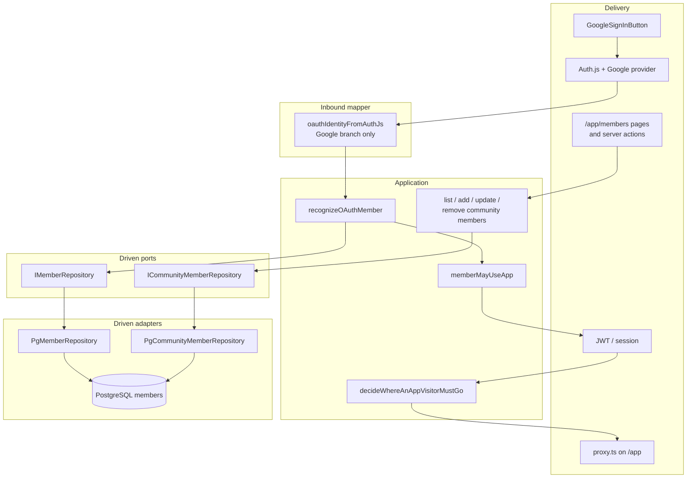
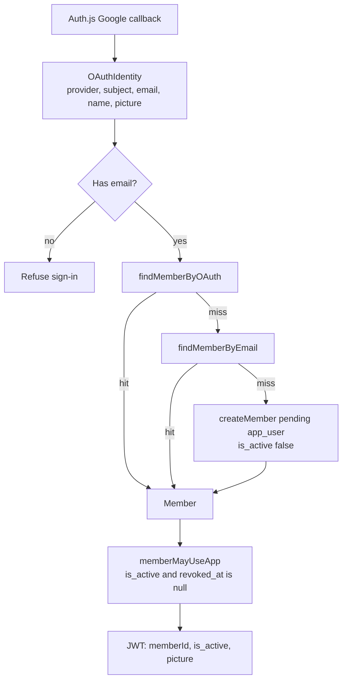
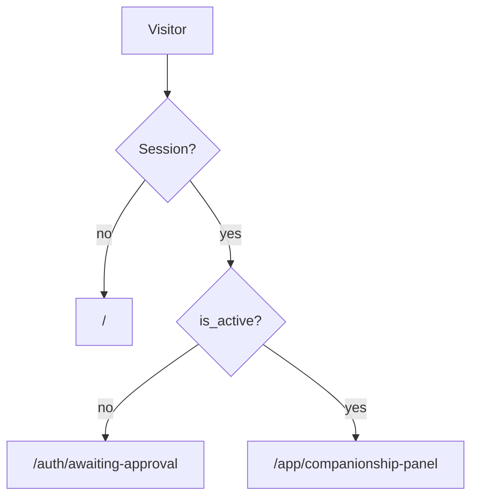
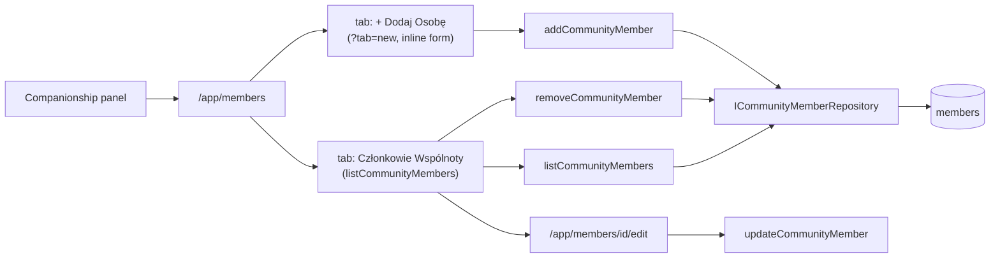
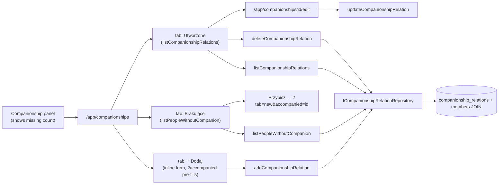
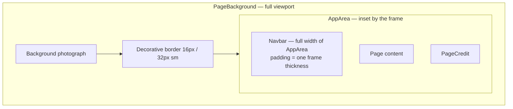
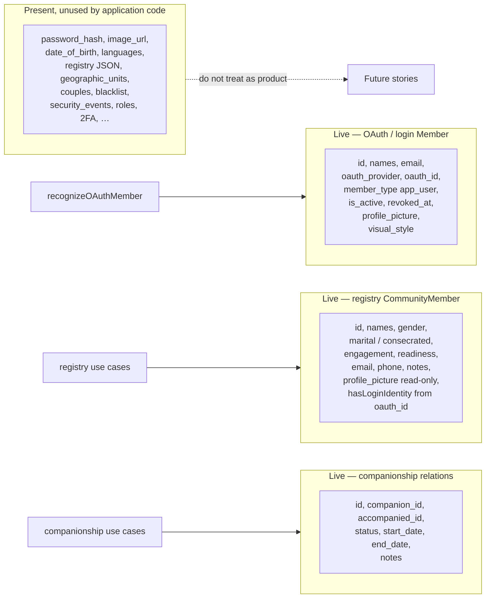

# Current architecture

How emmaCompanionship is built **today**, and why. Domain rules live in [application_idea.md](./application_idea.md); this file is the implementation map.

## Stack and why

| Choice | What we use | Why |
|---|---|---|
| Web | Next.js 16 App Router, React 19, TypeScript | Server-side session and routing; one repo for UI and auth callbacks |
| Auth delivery | Auth.js v5 (`next-auth@beta`), Google provider only | OAuth redirect, cookies, JWT — not our job to reimplement |
| Persistence | `pg` + raw SQL in `db/migrations/` | No Prisma. SQL stays reusable if another backend appears |
| Database | PostgreSQL 16 in Docker | Local, scripted via `npm run db:*` |
| UI | Tailwind CSS 4, motion | Existing look; decorative frame around a dark inner stage |
| Tests | Vitest | Fast unit tests for recognition, routing, registry writes, and operator copy |

Deliberately **not** in the live path: Nx, Prisma, Jest, Argon2/password login, Facebook, an `IOauthLogin` port wrapping Auth.js.

Grow the tree from working slices. Do not restore archived “production-grade” structure before a feature needs it. The reason we refuse that path (twice already) is [organic-growth.md](./organic-growth.md).

## Hexagon

Auth.js is the **inbound adapter** (browser → Google → callback). The application starts after someone has been confirmed. Persistence is a **driven port**.



**Why there is no `IOauthLogin` port.** Confirming identity at Google, holding cookies, and signing the JWT is delivery. Wrapping Auth.js would be hexagonal theater. A later GitHub or Facebook provider is another mapper branch plus an Auth.js provider — not a second use case.

**Three ports across two tables.** Login is `Member`. Registry is `CommunityMember`. Companionship is `CompanionshipRelation`. Do not hang list/update/delete on the OAuth port, and do not hang Google recognition on the registry port. Do not hang companionship tracking on member CRUD.

| Port | Type | What it does |
|---|---|---|
| `IMemberRepository` | `Member` | `findMemberById` / `findMemberByEmail` / `findMemberByOAuth` / `createMember` (scoped to `member_type = 'app_user'`). Also `updateMemberVisualStyle` for the signed-in person’s look. |
| `ICommunityMemberRepository` | `CommunityMember` | `listCommunityMembers` / `findCommunityMemberById` / `findCommunityMemberByEmail` / `addCommunityMember` / `updateCommunityMember` / `removeCommunityMember`. Lists **every** row. Writes omit OAuth, password, `is_active`, approval, `member_type`, and `profile_picture`. |
| `ICompanionshipRelationRepository` | `CompanionshipRelation` / `CompanionshipRelationListItem` / `PersonWithoutCompanion` | `listCompanionshipRelations` / `findCompanionshipRelationById` / `addCompanionshipRelation` / `updateCompanionshipRelation` / `deleteCompanionshipRelation` / `listPeopleWithoutCompanion`. Manages accompaniment tracking on `companionship_relations` table. List enriches with participant names and member details via JOIN. `listPeopleWithoutCompanion` returns every non-Looker-On member who appears in no `companionship_relations` row as `accompanied_id` (any status), sorted by last name then first name. |

`hasLoginIdentity` is derived from `oauth_id`; it is not a column. Registry inserts leave `member_type` unset so Postgres defaults to `'companion'`. Dropping `member_type` is a later login-identity story, not a form story.

## Auth behavior

### Recognize, then session



`recognizeOAuthMember` is provider-agnostic. Google is hardcoded only in `oauthIdentityFromAuthJs`.

The logout control shows the Google face from the JWT `picture`, then the stored `profile_picture` if the token has none. `` is required for Google avatar URLs.

### After sign-in, where they go

`/auth/continue` and `src/proxy.ts` (matcher `/app/:path*`) use the same idea: no session → home; `is_active` → stay on `/app` (continue sends approved members to the panel); otherwise awaiting-approval.



| Route | Who sees it |
|---|---|
| `/` | Signed-out landing; Google control |
| `/auth/continue` | Post-OAuth fork |
| `/auth/awaiting-approval` | Signed in, not approved |
| `/auth/error` | Sign-in failed; public copy has no npm/DB details |
| `/app/companionship-panel` | Approved member; **Członkowie wspólnoty**, **Akompaniamenty** (with missing count), Health Dashboard stub, **Ustawienia aplikacji** |
| `/app/members` | **Członkowie Wspólnoty** tab (list) or **+ Dodaj Osobę** tab (inline form) via `?tab=new` |
| `/app/members/new` | Redirects to `/app/members?tab=new` |
| `/app/members/[id]/edit` | **Edytuj**; missing id → 404 |
| `/app/companionships` | Three tabs: **Utworzone Akompaniamenty** (default), **Brakujące Akompaniamenty** (`?tab=missing`), **+ Dodaj Akompaniament** (`?tab=new`); `?accompanied=<id>` pre-fills the accompanied person on the add form |
| `/app/companionships/new` | Redirects to `/app/companionships?tab=new` (preserving `?accompanied`) |
| `/app/companionships/[id]/edit` | **Edytuj akompaniament**; missing id → 404 |

**Approval today** is not an admin screen. Create happens pending. An operator sets `members.is_active = true` (e.g. DBeaver). JWT fields are set at sign-in, so the member **must sign in again** after the flip (and after a `profile_picture` change).

**Errors.** `[emma]` logs may say `npm run db:start`. The public page does not. Local extra sentence when `OPERATOR_HINTS=1` or `NODE_ENV === 'development'`.

User-facing copy is Polish.

## Community registry

An approved member opens **Członkowie wspólnoty** and works people as registry entities. This slice does not turn them into login users. Google login stays the only way a row becomes an app identity.



- Required on write: `first_name`, `last_name`. `accompanying_readiness` defaults to `'Not Candidate'` in application code.
- Email is optional. If present it must look like an email and be unique across **all** member types (application check; the partial unique index stays `app_user`-only).
- Enum values match the SQL CHECKs, including the stored spelling `Commited`. Labels are Polish; stored values stay English.
- Consecrated-type is offered only when marital status is `consecrated`.
- **Usuń** is a hard `DELETE` and only when `!hasLoginIdentity`. A login row shows a hint, not a delete control. A FK block shows a Polish sentence with no table names.
- The list loads every in-scope row in one query (no pagination). Cards below the `lg` breakpoint, a table from `lg`. Imię and nazwisko stay visible; other columns are optional. Sort and shown fields live in `localStorage`. The table face is the Google `profile_picture` URL, not `image_url` (unused Base64).

## Companionship relations

An approved member opens **Akompaniamenty** from the panel and manages accompaniment relations (who accompanies whom). This slice does not validate business rules (gender, consecrated constraints, power separation). The delegate attests the relation is correct.



- Relation fields: `companion_id`, `accompanied_id`, `status` (`active` | `archived`), `start_date`, `end_date`, `notes`.
- Required on write: `companion_id`, `accompanied_id`. `status` defaults to `active`, `start_date` defaults to today.
- The list loads all relations via JOIN with `members` to fetch participant names and member details (marital status, consecrated status, community engagement).
- Member details from the JOIN are **read-only informational fields** — they must be edited in `/app/members`, not in companionship forms.
- **Utworzone** tab: responsive table (desktop `lg:`) with two-tier headers showing groups "Akompaniament" / "Akompaniowany" / "Akompaniator". Toggleable columns for member details per person. Two sticky columns (Akompaniowany, Akompaniator). Mobile shows cards. Sort and column visibility stored in `localStorage`.
- **Brakujące** tab: every eligible member (non-Looker-On) with no `accompanied_id` in any relation (any status). Fixed sort by last name, first name. Toggleable detail columns (marital status, consecrated type, engagement). Each row has a **Przypisz akompaniatora** link that opens the add tab with the person pre-selected.
- **+ Dodaj** tab: inline form. `?accompanied=<id>` pre-selects accompanied person. After save, redirects to the **Brakujące** tab if the form was opened from there, otherwise to **Utworzone**.
- Panel card shows `listPeopleWithoutCompanion().length` as the "Brakujące akompaniamenty" count.
- **Usuń** requires two-step confirmation (button label changes to confirm). Hard `DELETE` from `companionship_relations` table. FK constraints on `companion_id` and `accompanied_id` use `ON DELETE RESTRICT`.

## UI composition

The photograph is full-screen. A decorative frame sits on the viewport edge. The dark overlay and all chrome live **inside** that frame so nothing draws on the border.



Controls (logo, login) sit **two** frame-widths from the outer edge: one for the border, one for navbar padding. The login control is a child of `Navbar` (`rightContent`), pinned to the top-right so the Emmanuel mark cannot wrap under it. On small screens the Google control is the mark only (`aria-label` still “Zaloguj się przez Google”). The landing Google button stays glass even when the signed-in member chose high-contrast.

The `Navbar` accepts an optional `homeHref` prop that renders a centred home-icon link (48 × 48 px filled SVG house). App pages that serve a single domain (members, companionships) pass `homeHref="/app/companionship-panel"` so the delegate can return without a back link in the body. The navbar is `sticky top-0` within `AppArea` so it stays visible as the list scrolls.

Tab-based navigation is handled by the generic `TabbedPanel` component (`src/components/TabbedPanel.tsx`). It accepts a `tabs` array (`{ href, label, isActive? }`) and `children`. The tab nav is client-rendered (needs `useVisualStyle`); children may be server-rendered and passed through the RSC boundary. Both the members page and the companionships page use `TabbedPanel`.

Signed-in chrome (panel cards, registry, logout) follows `members.visual_style` on the **login** row: `semi-transparent` (Polish **Półprzeźroczysty**, the default when the column is empty) or `high-contrast` (**Kontrastowy**). The panel **Ustawienia aplikacji** card writes it through `updateMemberVisualStyle`. The client applies the choice immediately; the default is stored as `NULL`. The background photograph does not change.

| Session | Logo |
|---|---|
| Signed out | `/docs/img/logo_emmanuel_en-1.png` |
| Signed in, wide | `/docs/img/logo_emma_companionship.png` |
| Signed in, narrow | `/docs/img/logo_emma_companionship_square.png` |

## Database honesty

Migrations `001`–`008` create more tables than the app uses. **Schema ahead of the product is not the live contract.** Do not treat [`db/SCHEMA.md`](../db/SCHEMA.md) as current — it describes an unused auth-width plan.



- Unique email / OAuth indexes apply to `app_user` rows only. Registry email uniqueness is enforced in application code.
- `006_members_revoked_columns.sql` adds `revoked_at` / `revoked_by` on databases created before those columns existed.
- `007_members_visual_style.sql` adds nullable `visual_style` (`semi-transparent` \| `high-contrast`). Empty means the default look.
- `008_companionship_relations.sql` creates the `companionship_relations` table linking two `members` as companion and accompanied. `ON DELETE RESTRICT` on both FKs.
- Do not write features against blacklist, 2FA, couples, or roles until a story asks. No live port sees them.

## Local development

```bash
cp .env.example .env.local          # auth / shared secrets
# also create .env.development with discrete DB_* (see .env.example)
# AUTH_SECRET: openssl rand -base64 32
# GOOGLE_CLIENT_ID / GOOGLE_CLIENT_SECRET: Google Cloud OAuth Web client
# AUTH_URL=http://localhost:3000

npm run db:start          # docker compose postgres + create databases
npm run db:migrate:dev    # raw SQL on emma_companionship_dev
npm run dev               # Next loads .env.local + .env.development
```

Requires **Python 3.10+** (`python3`) for `npm run db:*` operator scripts. Logic lives in `db/scripts/db_scripts/` (stdlib only); `.sh` files are thin wrappers. Export/import use `SOURCE_PROFILE` / `TARGET_PROFILE` (defaults development → staging). See `.env.example` and `db/README.md`.

| Variable | Role |
|---|---|
| `DB_HOST`, `DB_PORT`, `DB_NAME`, `DB_USER`, `DB_PASSWORD` | Node `pg` pool (from `.env.development` on `next dev`) |
| `AUTH_SECRET` | Signs Auth.js cookies and state |
| `GOOGLE_CLIENT_*` | Google Web client |
| `OPERATOR_HINTS` | Extra local sentence on the error page when set to `1` |

**Port trap.** `docker-compose.yml` publishes `${DB_PORT:-5433}:5432`. `initializePool` uses `DB_PORT` or **5432**. If Compose uses 5433 and the app uses 5432, login fails with a refused connection. Set the same `DB_PORT` in `.env.development` that Compose publishes.

After the first Google login, approve the row and **sign in again**.

```bash
npm test              # src unit tests
npm run test:db       # needs migrated test database
npm run type-check
```

## How to extend without repeating old mistakes

- **Another OAuth provider:** add a branch in `oauthIdentityFromAuthJs` and an Auth.js provider. Do not fork `recognizeOAuthMember`.
- **Password / Facebook / blacklist / admin UI:** not in the live product. Do not rebuild them from archived plans.
- **Couples / graphs / geo / supervision / health tracking:** new ports and tables as each slice needs them. The person registry has `ICommunityMemberRepository`. Companionship tracking has `ICompanionshipRelationRepository`. Do not hang the next slice on either while "we are here".
- **Docs:** update this file when the running system changes. Put product rules in `application_idea.md`. Do not revive `_archived_docs/` or [`db/SCHEMA.md`](../db/SCHEMA.md) as current architecture.
