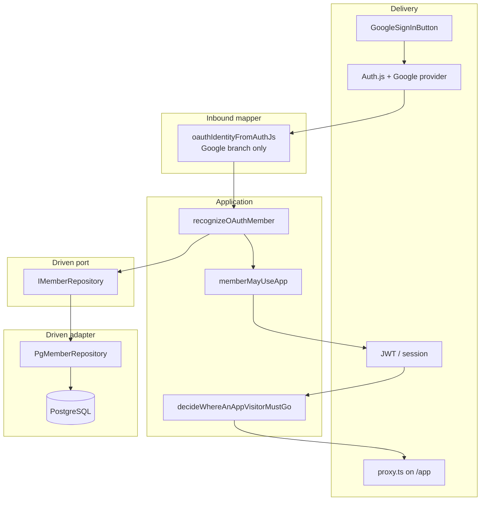
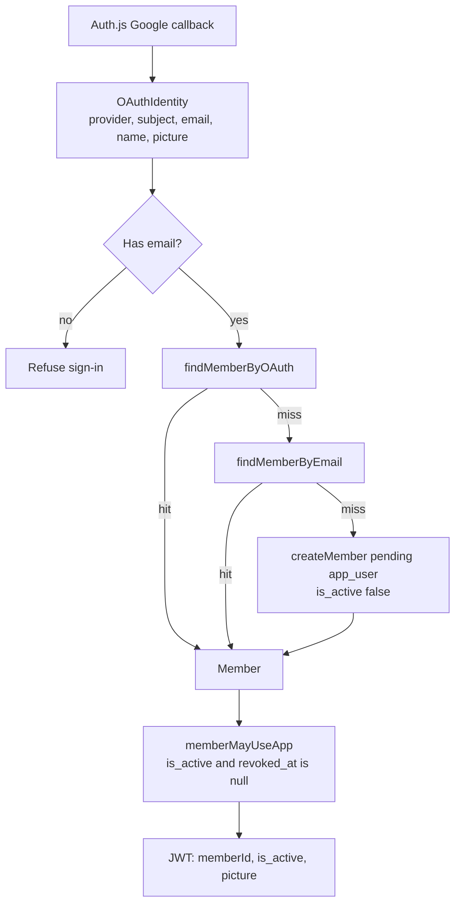
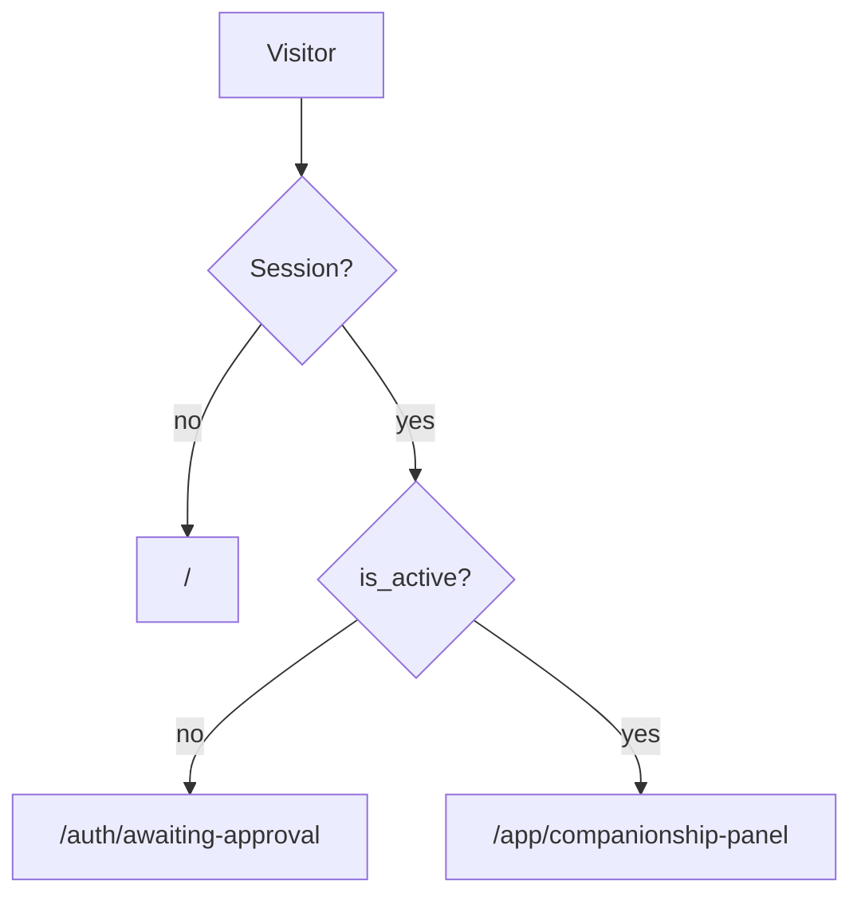
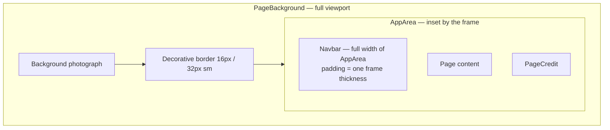
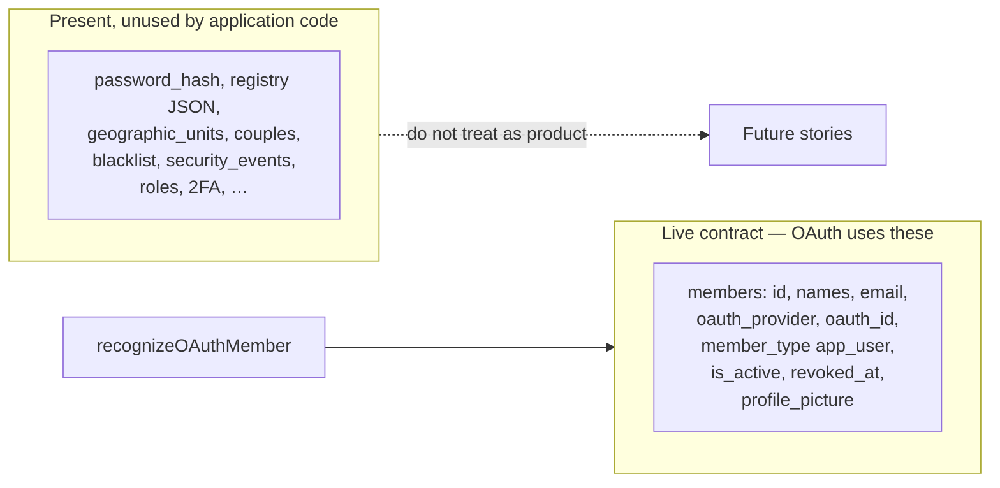

# Current architecture

How emmaCompanionship is built **today**, and why. Domain rules live in [application_idea.md](./application_idea.md); this file is the implementation map.

## Stack and why

| Choice | What we use | Why |
|---|---|---|
| Web | Next.js 16 App Router, React 19, TypeScript | Server-side session and routing; one repo for UI and auth callbacks |
| Auth delivery | Auth.js v5 (`next-auth@beta`), Google provider only | OAuth redirect, cookies, JWT — not our job to reimplement |
| Persistence | `pg` + raw SQL in `db/migrations/` | No Prisma. SQL stays reusable if another backend appears |
| Database | PostgreSQL 16 in Docker | Local, scripted via `npm run db:*` |
| UI | Tailwind CSS 4, motion | Existing look; decorative frame around a dark inner stage |
| Tests | Vitest | Fast unit tests for recognition, routing, and operator copy |

Deliberately **not** in the live path: Nx, Prisma, Jest, Argon2/password login, Facebook, an `IOauthLogin` port wrapping Auth.js.

Grow the tree from working slices. Do not restore archived “production-grade” structure before a feature needs it. The reason we refuse that path (twice already) is [organic-growth.md](./organic-growth.md).

## Hexagon

Auth.js is the **inbound adapter** (browser → Google → callback). The application starts after someone has been confirmed. Persistence is a **driven port**.



**Why there is no `IOauthLogin` port.** Confirming identity at Google, holding cookies, and signing the JWT is delivery. Wrapping Auth.js would be hexagonal theater. A later GitHub or Facebook provider is another mapper branch plus an Auth.js provider — not a second use case.

**Live member port** (`src/ports/repositories/IMemberRepository.ts`): `findMemberById`, `findMemberByEmail`, `findMemberByOAuth`, `createMember`. Lookups are scoped to `member_type = 'app_user'`. Do not widen this port for companionship entities until that slice exists.

## Auth behavior

### Recognize, then session



`recognizeOAuthMember` is provider-agnostic. Google is hardcoded only in `oauthIdentityFromAuthJs`.

### After sign-in, where they go

`/auth/continue` and `src/proxy.ts` (matcher `/app/:path*`) use the same idea: no session → home; `is_active` → stay on `/app` (continue sends approved members to the panel); otherwise awaiting-approval.



| Route | Who sees it |
|---|---|
| `/` | Signed-out landing; Google control |
| `/auth/continue` | Post-OAuth fork |
| `/auth/awaiting-approval` | Signed in, not approved |
| `/auth/error` | Sign-in failed; public copy has no npm/DB details |
| `/app/companionship-panel` | Approved member; placeholder cards |

**Approval today** is not an admin screen. Create happens pending. An operator sets `members.is_active = true` (e.g. DBeaver). JWT fields are set at sign-in, so the member **must sign in again** after the flip (and after a `profile_picture` change).

**Errors.** `[emma]` logs may say `npm run db:start`. The public page does not. Local extra sentence when `OPERATOR_HINTS=1` or `NODE_ENV === 'development'`.

User-facing copy is Polish.

## UI composition

The photograph is full-screen. A decorative frame sits on the viewport edge. The dark overlay and all chrome live **inside** that frame so nothing draws on the border.



Controls (logo, login) sit **two** frame-widths from the outer edge: one for the border, one for navbar padding. The login control is a child of `Navbar` (`rightContent`), pinned to the top-right so the Emmanuel mark cannot wrap under it. On small screens the Google control is the mark only (`aria-label` still “Zaloguj się przez Google”).

| Session | Logo |
|---|---|
| Signed out | `/docs/img/logo_emmanuel_en-1.png` |
| Signed in, wide | `/docs/img/logo_emma_companionship.png` |
| Signed in, narrow | `/docs/img/logo_emma_companionship_square.png` |

## Database honesty

Migrations `001`–`006` create more tables than the app uses. **Schema ahead of the product is not the live contract.**



- Unique email / OAuth apply to `app_user` rows only.
- `006_members_revoked_columns.sql` adds `revoked_at` / `revoked_by` on databases created before those columns existed.
- Do not write features against blacklist, 2FA, or roles until a story asks. The port does not see them.

## Local development

```bash
cp .env.example .env.local
# AUTH_SECRET: openssl rand -base64 32
# GOOGLE_CLIENT_ID / GOOGLE_CLIENT_SECRET: Google Cloud OAuth Web client
# AUTH_URL=http://localhost:3000

npm run db:start          # docker compose postgres + create databases
npm run db:migrate:dev    # raw SQL on emma_companionship_dev
npm run dev
```

| Variable | Role |
|---|---|
| `DB_HOST`, `DB_PORT`, `DB_NAME`, `DB_USER`, `DB_PASSWORD` | Node `pg` pool |
| `DATABASE_URL` | Convenience URL; keep it consistent with the pool |
| `AUTH_SECRET` | Signs Auth.js cookies and state |
| `GOOGLE_CLIENT_*` | Google Web client |
| `OPERATOR_HINTS` | Extra local sentence on the error page when set to `1` |

**Port trap.** `docker-compose.yml` publishes `${DB_PORT:-5433}:5432`. `initializePool` uses `DB_PORT` or **5432**. If Compose uses 5433 and the app uses 5432, login fails with a refused connection. Set the same `DB_PORT` in `.env.local` that Compose publishes.

After the first Google login, approve the row and **sign in again**.

```bash
npm test              # src unit tests
npm run test:db       # needs migrated test database
npm run type-check
```

## How to extend without repeating old mistakes

- **Another OAuth provider:** add a branch in `oauthIdentityFromAuthJs` and an Auth.js provider. Do not fork `recognizeOAuthMember`.
- **Password / Facebook / blacklist / admin UI:** not in the live product. Do not rebuild them from archived plans.
- **Companionship features:** new ports and tables as that slice needs them; do not hang them on `IMemberRepository` “while we are here”.
- **Docs:** update this file when the running system changes. Put product rules in `application_idea.md`. Do not revive `_archived_docs/` as current architecture.
