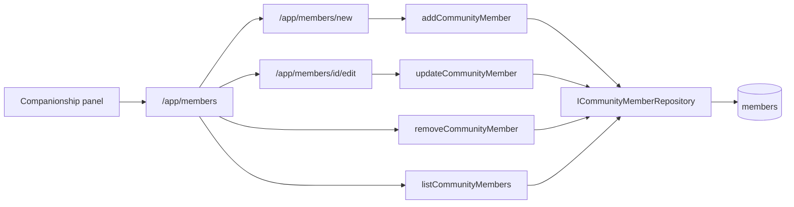
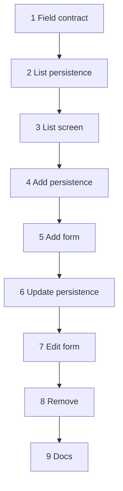

# Basic CRUD for member management - implementation plan

## Overview

`db/migrations/002_members_table.sql` already carries the `members` schema.
This document plans Create / Read / Update / Delete for **community members as
registry entities** — the Phase-1 “Add Person” workflow from
[`docs/application_idea.md`](../application_idea.md), minus couple, geography,
roles, and import.

The running app today is only Google OAuth → pending/approved → empty
companionship panel. This slice is the next vertical a signed-in Delegate can
click: see people, enter a person, correct a person, remove a mistaken
registry-only person.

## Scope

Basic management which means not all fields are required to be handled.
We define scope by listing fields from the member table that are out of scope;
all remaining fields are in scope:

- id — DB ID auto created
- first_name
- last_name
- gender
- marital_status
- consecrated_status
- community_engagement_status
- accompanying_readiness — default: `'Not Candidate'`
- email
- phone
- notes

`member_type` is **not** removed in this vertical. See
[Deferred: drop `member_type`](#deferred-drop-member_type).

### Out of scope

- date_of_birth (maybe will change just to class: youth (8-30), middle-age, elderly)
- languages (future update of language skills — requires ISO language codes)
- image_url (no handling of member image upload)
- profile_picture (already handled by auth functionality)
- geographic_unit_id (assignment to Geo-unit is future feature)
- couple_id (couple building is future feature)
- password_hash (future auth with email based registration/login flow)
- oauth_provider (already handled by auth functionality)
- oauth_id (already handled by auth functionality)
- is_active (activation panel is future feature)
- approved_by (activation panel is future feature)
- approved_at (activation panel is future feature)
- revoked_by (deactivation panel is future feature)
- revoked_at (deactivation panel is future feature)
- registry_check_result (future semi-automated activation)

Also out of this slice (domain exists, product does not yet):

- companionship / supervision relations
- graphs, health views, CSV/Excel import
- Delegate vs Province Head role checks (any approved `/app` visitor may use this)
- pagination, search, filters
- companionship eligibility / gender-follow / experience rules at save time
- REST API, Prisma, a second DB adapter

## Product slice

**Actor:** Province Delegate (today: any approved member who reached
`/app/companionship-panel`).

**Trigger:** Delegate needs a person in the system so later workflows can
assign companionship.

**Click path after this plan is done:**

1. Panel card **Członkowie wspólnoty** → `/app/members`
2. List of people already in `members` (including the Delegate’s own Google row)
3. **Dodaj osobę** → form → save → back to the list
4. Row **Edytuj** → same fields → save
5. Registry-only row **Usuń** → gone from the list

Non-Delegates exist as entities only. This slice does not turn them into
login users. Google login stays the only way a row becomes an app identity.

## Locked decisions

These are the choices so an implementer does not re-open architecture while
coding. Change them in this file first, then in code.

1. **New port, not a wider OAuth port.** Live
   `IMemberRepository` stays the login contract (`findMemberById` /
   `findMemberByEmail` / `findMemberByOAuth` / `createMember`, scoped to
   `member_type = 'app_user'`). Registry CRUD is
   `ICommunityMemberRepository`. Do not hang list/update/delete on the OAuth
   port. [`current-architecture.md`](../current-architecture.md) already says
   this.

2. **Auth `Member` stays the login identity.** Registry rows are
   `CommunityMember` (in-scope columns plus `id` plus a derived
   `hasLoginIdentity`). SQL column names stay snake_case on the type
   (`first_name`), matching today’s `Member`.

3. **No extra hexagon layers.** Pages and server actions are delivery.
   Application functions are the use cases. `PgCommunityMemberRepository` is
   the adapter. No `Manager`, no REST `/api/members`, no new `libs/`.

4. **Writes set only in-scope fields.** Inserts do not set OAuth, password,
   `is_active`, approval, or `member_type`. Postgres defaults apply:
   `member_type = 'companion'`, `is_active = false`. Application always sends
   `accompanying_readiness` (default `'Not Candidate'`) because the column has
   a CHECK but no DEFAULT.

5. **List shows every `members` row.** Google-created `app_user` rows are
   people too. Incomplete registry fields (null gender, etc.) are normal.

6. **Delete is hard `DELETE` and only for registry-only people.** If
   `oauth_provider` / `oauth_id` is set, refuse — that row is a login
   identity; deactivation is a later panel. If a FK blocks delete (couples,
   roles, 2FA), show a Polish error; do not cascade.

7. **Email is optional.** If present, it must look like an email. If another
   member already has that email, refuse at application level. Do not change
   the partial unique index in this vertical.

8. **Field CHECKs only.** Allowed enum values are exactly the SQL CHECKs.
   Do not encode “men accompany men” or consecrated experience rules here.

9. **Copy is Polish.** New UI strings follow the panel (“Witamy Delegata ds.
   Akompaniamentów”), not English placeholder cards.

10. **Tests are sentences** (`it('subject does what happens when conditions')`).
    Body Given / When / Then. Behavior you care about: validation, defaults,
    oauth/is_active left alone, refuse-delete of login identities, operator
    copy. No coverage cathedral, no E2E mandate.

11. **One chunk = one commit = one review.** After each chunk the app still
    builds, `npm test` passes, and Google login still works.

## What not to do

Read [`docs/organic-growth.md`](../organic-growth.md) before adding a layer
this file does not name.

- Do not drop or widen `member_type` “while we are here”.
- Do not add geographic units, couples, languages, or image upload.
- Do not restore archived admin / Prisma / password-login plans.
- Do not put companionship graph UI behind this form.

## Naming (code as prose)

| Thing | Name |
|---|---|
| Registry person | `CommunityMember` |
| Port | `ICommunityMemberRepository` |
| Adapter | `PgCommunityMemberRepository` |
| List | `listCommunityMembers` |
| Find one | `findCommunityMemberById` |
| Create | `addCommunityMember` |
| Update | `updateCommunityMember` |
| Delete | `removeCommunityMember` |
| “This row can sign in” | `hasLoginIdentity` |
| Predicate | `communityMemberHasLoginIdentity` |

Reuse branded `MemberId` — it is `members.id`.

## Allowed values (match SQL CHECKs)

Do not invent a second vocabulary.

| Field | Values |
|---|---|
| `gender` | `male`, `female`, or omit |
| `marital_status` | `single`, `married`, `widowed`, `consecrated`, or omit |
| `consecrated_status` | `priest`, `deacon`, `seminarian`, `sister`, `brother`, or omit |
| `community_engagement_status` | `Looker-On`, `In-Probation`, `Commited`, `In-Fraternity-Probation`, `Fraternity`, or omit |
| `accompanying_readiness` | `Not Candidate`, `Candidate`, `Ready`, `Active`, `Overwhelmed`, `Deactivated` |

`Commited` is the spelling in the database. Keep it.

Required on write: `first_name`, `last_name` (non-empty after trim).
`accompanying_readiness` may be omitted by the form; the use case then stores
`'Not Candidate'`.

## Polish labels (UI chunks)

| Field / action | Label |
|---|---|
| Page / card | Członkowie wspólnoty |
| Add | Dodaj osobę |
| Edit | Edytuj |
| Remove | Usuń |
| Save | Zapisz |
| Cancel | Anuluj |
| Empty list | Nie ma jeszcze osób w rejestrze. |
| `first_name` | Imię |
| `last_name` | Nazwisko |
| `gender` | Płeć |
| `male` / `female` | mężczyzna / kobieta |
| `marital_status` | Stan cywilny |
| `consecrated_status` | Typ osoby konsekrowanej |
| `community_engagement_status` | Zaangażowanie we wspólnocie |
| `accompanying_readiness` | Gotowość do akompaniamentu |
| `email` | E-mail |
| `phone` | Telefon |
| `notes` | Notatki |
| Login row, no delete | Ta osoba loguje się do aplikacji. Nie usuwaj jej tutaj. |
| Duplicate email | Ta skrzynka e-mail jest już w rejestrze. |

Keep enum **values** in English as stored. Translate only labels.

---

## Chunks

Order is dependency order. Do not start chunk N+1 until chunk N is reviewed
(or explicitly waived). Each chunk lists the files it is *allowed* to touch;
if you need more, the chunk is too big — split it.

### Chunk 1 — Registry field contract

**Goal:** A reviewer can agree what a community member is, and which writes
are valid, without UI or SQL.

**Why this size:** The CHECK list and defaults are the whole product contract
for this slice. Getting them wrong later means rewriting forms and adapters.

**Depends on:** nothing.

**Files:**

- add `src/types/community-member.ts`
- add `src/schemas/community-member.ts`
- add `src/schemas/community-member.test.ts`

**Do:**

- `CommunityMember` with in-scope fields, `id: MemberId`, and
  `hasLoginIdentity: boolean` (always `false` in this chunk’s fixtures; the
  adapter will set it later).
- `CommunityMemberWrite` (or equivalent) for create/update input: no `id`,
  no `hasLoginIdentity`.
- Zod schema aligned with the CHECKs above. Trim names. Empty optional
  strings become omit/null. Invalid enum → fail.
- Default readiness applied by a named function, e.g.
  `communityMemberWriteWithDefaults`, not buried in a form.

**Do not:** repository, pages, migration, touching `Member` / OAuth types.

**Tests (sentences):**

- `communityMemberWriteWithDefaults sets accompanying_readiness to Not Candidate when the write omits it`
- `the community member schema refuses a gender that the members table would reject`
- `the community member schema refuses a blank first_name`

**Verify:** `npm test` (new tests only; existing auth tests unchanged).

**Commit:** `Describe the community member fields this registry slice may write.`

---

### Chunk 2 — List persistence

**Goal:** Application code can list and load community members from Postgres
without changing login.

**Why this size:** SQL column choice and port shape are the review. UI would
hide that.

**Depends on:** chunk 1.

**Files:**

- add `src/ports/repositories/ICommunityMemberRepository.ts`
- add `src/adapters/db/pg/PgCommunityMemberRepository.ts`
- add `src/application/list-community-members.ts`
- add `src/application/list-community-members.test.ts`
- add `src/application/find-community-member.ts`
- add `src/application/find-community-member.test.ts`
- change `src/ports/repositories/IRepositoryContainer.ts` — one getter
- change `src/adapters/db/pg/PgRepositoryContainer.ts` — lazy adapter
- do **not** change `IMemberRepository` or `PgMemberRepository`

**Do:**

- Port methods: `listCommunityMembers()`, `findCommunityMemberById(id)`.
- `SELECT` only in-scope columns plus `id`, `oauth_provider`, `oauth_id`
  (oauth columns are used only to derive `hasLoginIdentity`; they must not
  appear on forms later).
- `hasLoginIdentity` is true when `oauth_id` is not null.
- `listCommunityMembers` / `findCommunityMemberById` are thin application
  wrappers (pool start + repository), same pattern as
  `recognizeOAuthMember`’s repository default.
- Order list by `last_name`, `first_name` so the later screen is stable.

**Do not:** INSERT/UPDATE/DELETE. Do not filter `member_type`. Do not add UI.

**Tests:** fake repository — list returns the rows the port gave; find
returns null when missing. No new Docker test required (auth already has no
Pg unit tests). Optional: one `db/tests` example that a companion row and an
`app_user` row both appear. Skip if it balloons the chunk.

**Verify:** `npm test`. Sign-in still works if you run the app.

**Commit:** `Read community members through a registry port, not the OAuth port.`

---

### Chunk 3 — List screen (first clickable vertical)

**Goal:** An approved Delegate opens the panel, clicks **Członkowie
wspólnoty**, and sees people already in the database (at least themselves
after Google login).

**Why this size:** Layout, navigation, and Polish empty/populated states are
one UX review. No writes yet.

**Depends on:** chunk 2.

**Files:**

- add `src/app/app/members/page.tsx`
- add `src/app/app/members/CommunityMemberList.tsx` (client only if motion
  needs it; prefer a server page + small presentational component)
- change `src/app/app/companionship-panel/CompanionshipPanel.tsx` — one
  placeholder card becomes a link to `/app/members`
- reuse `PageBackground`, `AppArea`, `Navbar`, `LogoutButton`, `PageTitle`

**Do:**

- Route stays under `/app`, so existing `proxy.ts` / app layout keep the
  approval gate. No new auth logic.
- Table or simple list: name, optional email. No oauth ids, no `is_active`.
- Empty copy: `Nie ma jeszcze osób w rejestrze.`
- Link **Dodaj osobę** may render but must not 404 later — either omit it
  until chunk 5 or point at `/app/members/new` and accept a Next 404 for one
  chunk. Prefer **omit the add link until chunk 5** so this chunk is fully
  usable.
- Card title Polish; leave the other two English placeholders alone.

**Do not:** forms, mutations, edit/delete controls.

**Tests:** a small unit test that the panel card targets `/app/members` is
enough if it stays cheap. Do not stand up Playwright.

**Verify:** sign in as an approved member → panel → list shows that member’s
name. `npm test`. Look at the list in the browser (desktop and a narrow
viewport).

**Commit:** `Let a Delegate open a list of community members from the panel.`

---

### Chunk 4 — Add persistence

**Goal:** `addCommunityMember` inserts a registry row with the agreed
defaults and never creates a login identity.

**Why this size:** Insert SQL and “what we refuse to write” are the review.
The form is the next chunk.

**Depends on:** chunk 2 (port exists), chunk 1 (write schema).

**Files:**

- change `ICommunityMemberRepository` / `PgCommunityMemberRepository` —
  add `addCommunityMember`
- add `src/application/add-community-member.ts`
- add `src/application/add-community-member.test.ts`

**Do:**

- Insert in-scope fields only. Omit oauth, password, `is_active`,
  `member_type`, profile picture.
- Apply `communityMemberWriteWithDefaults` before insert.
- If email is present, `find` by email across **all** member types; if a row
  exists, throw a named error (e.g. `DuplicateCommunityMemberEmail`) — not a
  generic `Error`.
- Return the created `CommunityMember`.
- Reuse `UnavailableDatabase` reporting if the pool is down, same spirit as
  OAuth recognition. Do not invent a second operator-log dialect.

**Do not:** HTTP, forms, UPDATE/DELETE.

**Tests:**

- `addCommunityMember stores Not Candidate when the Delegate omits accompanying readiness`
- `addCommunityMember does not mark the new person as an app login`
- `addCommunityMember refuses an email another member already has`

Fake repository is enough: assert the object passed to the port has
`member_type` unset / oauth unset, and that a stubbed existing email
short-circuits insert.

**Verify:** `npm test`.

**Commit:** `Let the registry add a community member without creating a login.`

---

### Chunk 5 — Add person form

**Goal:** Delegate fills Polish fields, saves, and sees the person on the
list.

**Why this size:** First mutation UI + server action. Keep it one screen.

**Depends on:** chunks 3 and 4.

**Files:**

- add `src/app/app/members/new/page.tsx`
- add `src/app/app/members/CommunityMemberForm.tsx` (shared with edit later;
  if sharing fights you, duplicate the markup and extract in chunk 7)
- add `src/app/app/members/actions.ts` — `'use server'`, one function
  `submitNewCommunityMember`
- change list page — show **Dodaj osobę**

**Do:**

- Server action: read FormData → zod → `addCommunityMember` →
  `redirect('/app/members')`.
- Validation errors re-render the form with Polish messages. Do not leak SQL
  or npm commands to the member.
- Duplicate email → the Polish sentence in the label table.
- Selects for enums; empty option for optional fields. Readiness select may
  default to Not Candidate in the UI as well as in the use case.
- Cancel returns to the list.

**Do not:** edit, delete, file upload, client-side schema duplicated in a
second language.

**Verify:** browser — add a person with only imię/nazwisko; they appear on
the list. Add a second with a duplicate email; form stays, error shows.
`npm test`. `npm run type-check`.

**Commit:** `Give Delegates a form to enter a community member.`

---

### Chunk 6 — Update persistence

**Goal:** In-scope fields change; login and approval columns do not.

**Why this size:** UPDATE SQL is easy to get greedy. Review it without JSX.

**Depends on:** chunk 4.

**Files:**

- change port + `PgCommunityMemberRepository` — `updateCommunityMember`
- add `src/application/update-community-member.ts`
- add `src/application/update-community-member.test.ts`

**Do:**

- `updateCommunityMember(id, write)`: same zod/defaults as add.
- `UPDATE` only in-scope columns and `updated_at`. SET list must not mention
  oauth, `is_active`, `revoked_*`, `member_type`, `profile_picture`.
- Missing id → named not-found error.
- Duplicate email: same rule as add, ignoring the row being edited.
- Return the updated `CommunityMember`.

**Do not:** UI.

**Tests:**

- `updateCommunityMember writes notes without touching oauth or is_active`
- `updateCommunityMember tells the Delegate when the person is not in the registry`
- `updateCommunityMember refuses an email owned by a different member`

**Verify:** `npm test`.

**Commit:** `Update community member registry fields without touching login columns.`

---

### Chunk 7 — Edit form

**Goal:** Delegate opens a person from the list, changes fields, saves, sees
the list updated.

**Why this size:** Prefill, 404, and reuse of the form are one UX review.

**Depends on:** chunks 3, 5, 6.

**Files:**

- add `src/app/app/members/[id]/edit/page.tsx`
- change `actions.ts` — `submitCommunityMemberEdits`
- change list — **Edytuj** link per row
- extract/share `CommunityMemberForm` if chunk 5 did not already

**Do:**

- Load with `findCommunityMemberById`. Missing → `notFound()`.
- Prefill all in-scope fields. Do not show oauth, `is_active`, or
  `hasLoginIdentity` as editable controls (a short read-only hint that the
  person can log in is allowed).
- Same Polish validation as add.
- Cancel → list.

**Do not:** delete button yet (chunk 8).

**Verify:** browser — edit last name of the person from chunk 5; list
shows it. Open a garbage UUID; 404. Existing Google member can be edited
(name) without breaking the next sign-in. `npm test`.

**Commit:** `Let a Delegate correct a community member’s registry fields.`

---

### Chunk 8 — Remove

**Goal:** Delegate can drop a mistaken registry-only person, and cannot drop
a login identity.

**Why this size:** Policy + UI confirm belong together so review sees both.

**Depends on:** chunk 7 (list + edit exist).

**Files:**

- change port + adapter — `removeCommunityMember`
- add `src/application/remove-community-member.ts`
- add `src/application/remove-community-member.test.ts`
- change `actions.ts` — `submitCommunityMemberRemoval`
- change list (and optionally edit) — **Usuń** only when
  `!hasLoginIdentity`, with `confirm()` or a tiny confirm step

**Do:**

- Load the row first. If missing → not-found error.
- If `hasLoginIdentity` → named error
  (`CannotRemoveCommunityMemberWhoCanSignIn`); never `DELETE`.
- Else `DELETE FROM members WHERE id = $1`.
- FK failure → Polish “nie można usunąć, bo osoba jest powiązana z innymi
  danymi” (no table names in the UI).
- After success, redirect to the list.

**Do not:** soft delete, revoke, cascade, admin deactivation.

**Tests:**

- `removeCommunityMember deletes a registry-only person`
- `removeCommunityMember refuses a person who can sign in with Google`
- `removeCommunityMember does not call delete when the person can sign in`

**Verify:** browser — remove the person added in chunk 5. Try to imagine
deleting yourself: the control is absent on the Google row. Sign out/in still
works. `npm test`.

**Commit:** `Allow removing registry-only members and refuse to delete login identities.`

---

### Chunk 9 — Architecture docs

**Goal:** [`current-architecture.md`](../current-architecture.md) and
[`docs/README.md`](../README.md) describe the running registry slice so the
next session does not treat this plan as the only truth.

**Depends on:** chunk 8 (the vertical runs).

**Files:**

- change `docs/current-architecture.md` — second live port, routes, what
  `members` columns the registry uses vs still unused
- change `docs/README.md` — “not built yet” no longer says “community
  registry CRUD”
- this plan: mark chunks done only if you track checkboxes; do not copy the
  plan into architecture

**Do not:** revive `_archived_docs`. Do not document couples/geo as live.

**Verify:** a new reader of `docs/README.md` learns they can add a person
after login.

**Commit:** `Document the live community member registry in current architecture.`

---

## Deferred: drop `member_type`

The original scope wanted `member_type` gone because `is_active` already
gates the app. That is true for **approval**, not for **who is a login
identity**.

Today:

- Auth lookups and unique email/OAuth indexes are scoped to
  `member_type = 'app_user'`.
- This slice inserts default `'companion'` rows so Google recognition cannot
  pick them up by email and create a second `app_user` **or** accidentally
  attach OAuth to a registry row without a dedicated story.

Dropping the column is a **login-identity story**, not a form story. It
needs its own plan: migration, rewrite of partial unique indexes, change of
`PgMemberRepository` filters, a decision on “CD typed this email, then the
person signs in with Google”, and the constraint tests in
`db/tests/constraints.test.ts`.

Do not fold that into any chunk above.

## Review bar (every chunk)

A human should be able to answer “yes” without reading later chunks:

1. Does the diff do one job named in the chunk title?
2. Are names nouns/verbs from the table above?
3. Are tests full sentences with Given / When / Then bodies?
4. Did OAuth recognition and `/app` gating stay intact?
5. Is new UI Polish?
6. Were out-of-scope columns left untouched?

## Implementation notes for whoever codes this

- Grow from [`docs/current-architecture.md`](../current-architecture.md), not
  from `_archived_docs/prd/epic-1-foundation-core-member-management.md`.
- Server actions are new to this repo; keep them as inbound adapters (parse,
  call one application function, redirect or return errors).
- `queryMany` in `src/infrastructure/db/pg.ts` is the list helper.
- No new migration is required for this vertical: CHECKs already exist;
  defaults for `member_type` / `is_active` already exist; readiness default
  is applied in application code.
- After chunk 3, verify in the browser. After chunks 5, 7, and 8, verify the
  click path again (list ↔ add ↔ edit ↔ remove, plus the Google member still
  listed and not deletable).
