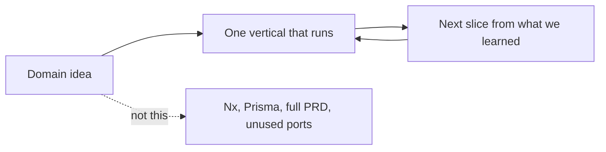

# Organic growth — stay out of the planning trap

This project fell into the same trap **twice**: months of architecture, research, and “production-grade” docs before a thin vertical worked. The second time included a wide auth/DB plan (password, Facebook, blacklist, admin UI, dual Prisma/pg) that the running app never needed. Git still has that history. This file exists so the next session does not rebuild it.

**Domain knowledge is the keeper.** [application_idea.md](./application_idea.md) is solid. The failure was imposing structure, extra providers, and unused tables *before* a slice existed.

**Organic growth is the recovery.** One working vertical, then the next (today: Google OAuth → pending/approved → panel → community member registry). Folder layout, ports, and migrations grow when a story needs them. See [current-architecture.md](./current-architecture.md).

## What the trap looks like

- Designing the whole system (Nx, unified trees, every table, every OAuth vendor) before login works.
- Writing implementation plans that agents treat as the current backlog.
- Widening a port or migration “so we will not have to later”.
- Loading `_archived_docs/` or old plans as if they described the running app.
- Tests-for-coverage mandates, Storybook, E2E, deploy — before two features feel real.

Those artifacts felt like progress. They blocked seeing a screen and changing it.

## How we work instead

1. Read [current-architecture.md](./current-architecture.md) for what exists. Read the idea doc for *what the product is*, not *what to scaffold*.
2. Implement the smallest slice that a person can click. Then the next. How: `.cursor/skills/feature-recipe/SKILL.md`. After live docs match the running slice, **delete the working plan** — git already has it.
3. Add a port, table, or provider when that slice needs it — not because an old plan listed it.
4. Tests for behavior you care about (recognition, visit routing, operator copy). Not a coverage cathedral.
5. When unsure:

| Urge | Do this instead |
|---|---|
| New shared `libs/` or hexagon layer | Wait until the same shape exists three times |
| Prisma / second DB adapter / Nx | We use `pg` + raw SQL and plain Next.js until a story forces a change |
| Facebook, password, blacklist, admin UI | Not in the live product. Do not restore from archive |
| “Document the full future schema” | Document the live contract; tag unused tables as unused |
| “The folder structure looks incomplete” | If you can find the code and the slice runs, it is complete enough |

## Why a short file, not the old session notes

The previous `refactor_to_organic_growth.md` mixed the lesson with a Prisma/Jest/member-CRUD checklist that became false the day Google login shipped. A guardrail that contains a stale plan *is* the trap. This file is only the lesson. Implementation truth stays in `current-architecture.md`.
